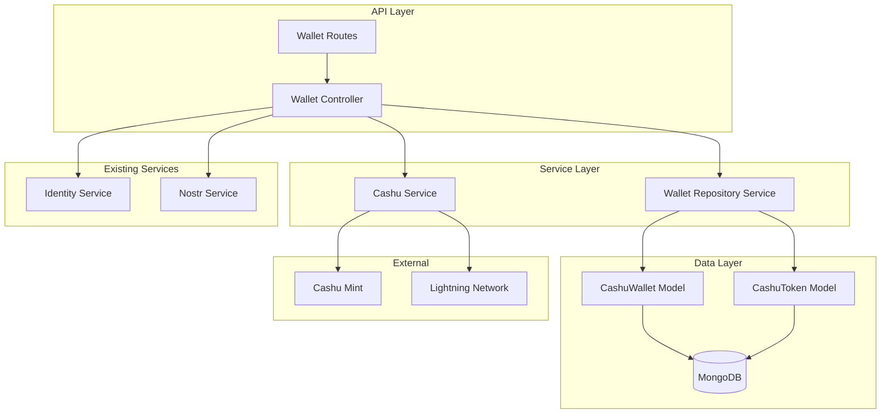

# Cashu Wallet Services Implementation Plan

## Overview

Implementation of Cashu ecash wallet services following existing API conventions, using the cashu-ts library and MongoDB for token storage.

## Architecture Overview



## Database Schema

### CashuWallet Collection

```javascript
{
  _id: ObjectId,
  npub: String, // User identifier (indexed)
  mint_url: String, // Cashu mint URL
  p2pk_pubkey: String, // Public key for P2PK transactions
  p2pk_privkey: String, // Encrypted private key
  wallet_config: {
    unit: String, // 'sat' for satoshis
    created_via: String // 'api' or 'nostr'
  },
  created_at: Date,
  updated_at: Date
}
```

We will have 1 wallet per nPub.

### CashuToken Collection

```javascript
{
  _id: ObjectId,
  npub: String, // User identifier (indexed)
  wallet_id: ObjectId, // Reference to CashuWallet
  proofs: Array, // Cashu proof objects
  mint_url: String,
  total_amount: Number,
  status: String, // 'unspent', 'spent', 'pending'
  transaction_type: String, // 'received', 'sent', 'minted', 'melted'
  transaction_id: String, // For tracking related operations
  metadata: {
    source: String, // 'lightning', 'p2p', 'mint'
    encoded_token: String, // Original encoded token if received
    lightning_invoice: String, // If from Lightning
    recipient_info: String // If sent to someone
  },
  created_at: Date,
  spent_at: Date
}
```

There will be many cashu tokens per wallet.

## API Endpoints

### Base Route: `/api/wallet/:npub`

| Method | Endpoint         | Description                                |
| ------ | ---------------- | ------------------------------------------ |
| POST   | `/create`        | Create new wallet (existing functionality) |
| GET    | `/balance`       | Get wallet balance                         |
| POST   | `/mint`          | Mint tokens from Lightning invoice         |
| POST   | `/send`          | Send tokens to another user                |
| POST   | `/receive`       | Receive tokens from encoded token          |
| POST   | `/melt`          | Pay Lightning invoice with tokens          |
| GET    | `/proofs/status` | Check proof states                         |
| GET    | `/transactions`  | Get transaction history                    |
| GET    | `/info`          | Get wallet information                     |

## Implementation Plan

### Phase 1: Database Models and Repository Layer

1. **Create CashuWallet Model** (`src/models/CashuWallet.model.js`)

   - Define schema with validation
   - Add indexes for npub and mint_url
   - Include wallet configuration options

2. **Create CashuToken Model** (`src/models/CashuToken.model.js`)

   - Define schema with proof storage
   - Add indexes for npub, status, transaction_type
   - Include transaction metadata

3. **Create Wallet Repository Service** (`src/services/walletRepository.service.js`)
   - CRUD operations for wallets and tokens
   - Balance calculation methods
   - Transaction history queries
   - Proof state management

### Phase 2: Enhanced Cashu Service Layer

4. **Extend Cashu Service** (`src/services/cashu.service.js`)
   - Initialize CashuWallet and CashuMint instances
   - Implement core operations:
     - `mintTokens(npub, amount)` - Create mint quote and mint tokens
     - `sendTokens(npub, amount, recipientPubkey?)` - Send tokens
     - `receiveTokens(npub, encodedToken)` - Receive tokens
     - `meltTokens(npub, invoice)` - Pay Lightning invoice
     - `getBalance(npub)` - Calculate total balance
     - `checkProofStates(npub, proofs?)` - Verify proof states

### Phase 2.5: Testing and Validation

5. **Create Test Endpoints** (`src/controllers/test.controller.js`)

   - Add temporary test endpoints for Phase 1-2 validation:
     - `POST /api/test/wallet/create` - Test wallet creation with new models
     - `POST /api/test/wallet/mint` - Test minting process without full API
     - `GET /api/test/wallet/:npub/balance` - Test balance calculation
     - `POST /api/test/tokens/store` - Test token storage and retrieval
   - Include detailed logging and response validation
   - Add test routes to verify database operations work correctly

6. **Manual Testing Documentation**
   - Create test scenarios for each Phase 1-2 component
   - Provide curl commands or Postman collection for manual testing
   - Include expected responses and error cases
   - Document how to verify database state after operations

**Pause Point**: Manual testing and validation of database models and service layer before proceeding to full API implementation.

### Phase 3: Controller Implementation

7. **Extend Wallet Controller** (`src/controllers/wallet.controller.js`)
   - Add new endpoint handlers:
     - `getBalance` - Return wallet balance
     - `mintTokens` - Handle Lightning to ecash conversion
     - `sendTokens` - Handle token sending
     - `receiveTokens` - Handle token receiving
     - `meltTokens` - Handle ecash to Lightning conversion
     - `checkProofStates` - Verify proof validity
     - `getTransactionHistory` - Return transaction list
     - `getWalletInfo` - Return wallet metadata

### Phase 4: Route Configuration

8. **Update Wallet Routes** (`src/routes/wallet.routes.js`)
   - Add new routes with npub parameter
   - Implement parameter validation
   - Add error handling middleware

### Phase 5: Integration and Testing

9. **Integration Tasks**
   - Update existing wallet creation to use new models
   - Migrate existing wallet data if needed
   - Add comprehensive error handling
   - Implement transaction logging

## Detailed API Specifications

### GET `/api/wallet/:npub/balance`

**Response:**

```json
{
  "npub": "npub1...",
  "total_balance": 1000,
  "unspent_balance": 800,
  "pending_balance": 200,
  "mint_url": "https://mint.example.com",
  "token_count": 5
}
```

### POST `/api/wallet/:npub/mint`

**Request:**

```json
{
  "amount": 1000
}
```

**Response:**

```json
{
  "quote_id": "quote_123",
  "lightning_invoice": "lnbc...",
  "amount": 1000,
  "expiry": 1234567890,
  "status": "pending"
}
```

### POST `/api/wallet/:npub/send`

**Request:**

```json
{
  "amount": 500,
  "recipient_pubkey": "02abc..." // Optional for P2PK
}
```

**Response:**

```json
{
  "encoded_token": "cashuAbc...",
  "amount": 500,
  "change_amount": 300,
  "transaction_id": "tx_123"
}
```

### POST `/api/wallet/:npub/receive`

**Request:**

```json
{
  "encoded_token": "cashuAbc...",
  "private_key": "abc..." // Optional for P2PK tokens
}
```

**Response:**

```json
{
  "amount_received": 500,
  "transaction_id": "tx_124",
  "new_balance": 1300
}
```

### POST `/api/wallet/:npub/melt`

**Request:**

```json
{
  "lightning_invoice": "lnbc..."
}
```

**Response:**

```json
{
  "payment_hash": "abc123...",
  "amount_paid": 1000,
  "fees_paid": 10,
  "change_amount": 0,
  "transaction_id": "tx_125"
}
```

## Error Handling Strategy

### Common Error Responses

- `400 Bad Request` - Invalid parameters or malformed requests
- `404 Not Found` - Wallet or user not found
- `409 Conflict` - Insufficient balance or double-spend attempt
- `422 Unprocessable Entity` - Invalid token or proof states
- `500 Internal Server Error` - Mint communication or system errors

### Error Response Format

```json
{
  "error": "Insufficient balance",
  "code": "INSUFFICIENT_BALANCE",
  "details": {
    "required": 1000,
    "available": 500
  }
}
```

## Security Considerations

1. **Private Key Storage**: P2PK private keys encrypted in database
2. **Proof Validation**: Always verify proof states before operations
3. **Amount Validation**: Validate amounts and prevent overflow
4. **Rate Limiting**: Implement rate limiting for mint operations
5. **Input Sanitization**: Validate all user inputs and encoded tokens

## Dependencies

### Required NPM Packages (Already Installed)

- `@cashu/cashu-ts` - Cashu protocol implementation
- `mongoose` - MongoDB ODM
- `nostr-tools` - Nostr protocol utilities

### Environment Variables

```env
MINT_URL=https://mint.minibits.cash/Bitcoin
CASHU_UNIT=sat
```

## Migration Strategy

1. **Backward Compatibility**: Existing wallet creation endpoint remains functional
2. **Data Migration**: Script to migrate existing wallet data to new schema
3. **Gradual Rollout**: New endpoints can be deployed alongside existing functionality

## Testing Strategy

1. **Unit Tests**: Test individual service methods
2. **Integration Tests**: Test API endpoints with mock mint
3. **End-to-End Tests**: Test complete workflows with test mint
4. **Load Tests**: Test performance with multiple concurrent operations

## Documentation Updates

1. **API Documentation**: Update with new endpoints and examples
2. **README**: Add Cashu wallet usage instructions
3. **Changelog**: Document new features and breaking changes
4. **ADR**: Create Architecture Decision Record for Cashu integration

## Future Enhancements

1. **WebSocket Support**: Real-time updates for mint quotes and payments
2. **Multi-Mint Support**: Support for multiple mint URLs per user
3. **Token Backup**: Encrypted backup and recovery mechanisms
4. **Advanced P2PK**: Enhanced P2PK transaction features
5. **Lightning Integration**: Direct Lightning node integration
