# Architectural Improvements Documentation

**Date:** 2025-08-08  
**Status:** Production Ready  
**Version:** 2.0  
**Priority:** Critical - Architecture Design Patterns

## Executive Summary

This document details the architectural improvements implemented in the updated melt operation system. These improvements address fundamental design flaws, implement production-tested patterns, and establish a robust foundation for reliable Cashu token operations.

## Table of Contents

1. [Architecture Evolution](#architecture-evolution)
2. [Design Pattern Implementation](#design-pattern-implementation)
3. [Double-Counting Elimination](#double-counting-elimination)
4. [Atomic Transaction Architecture](#atomic-transaction-architecture)
5. [Proof State Reconciliation Architecture](#proof-state-reconciliation-architecture)
6. [Error Classification System](#error-classification-system)
7. [Repository Pattern Enhancement](#repository-pattern-enhancement)
8. [Service Layer Improvements](#service-layer-improvements)
9. [Data Consistency Guarantees](#data-consistency-guarantees)
10. [Performance Architecture](#performance-architecture)

---

## Architecture Evolution

### Before: Problematic Sequential Operations


**Problems with Previous Architecture:**
- ❌ **Non-atomic operations** - Risk of partial state corruption
- ❌ **Double-counting** - Storing consumed proofs in "melted" documents
- ❌ **No proof validation** - Operating on potentially spent proofs
- ❌ **Sequential failures** - No rollback mechanism
- ❌ **Inconsistent state** - Database could diverge from mint truth

### After: Production-Ready Atomic Architecture


**Improvements in New Architecture:**
- ✅ **Atomic transactions** - All-or-nothing database operations
- ✅ **Pre-flight validation** - Proof state verification before operations
- ✅ **Proper change handling** - No storage of consumed proofs
- ✅ **Enhanced error handling** - Severity-based classification and recovery
- ✅ **State consistency** - Database always matches mint ground truth

---

## Design Pattern Implementation

### 1. Repository Pattern Enhancement

#### Before: Direct Database Access
```javascript
// Problematic: Direct model access in service layer
await CashuToken.updateMany(
  { _id: { $in: tokenIds } },
  { $set: { status: "spent" } }
);

await CashuToken.create({
  proofs: consumedProofs, // ❌ WRONG: Storing consumed proofs
  transaction_type: "melted"
});
```

#### After: Repository Abstraction
```javascript
// Correct: Repository pattern with atomic operations
await walletRepositoryService.executeAtomicMelt(
  sourceTokenIds,
  keepProofs,
  meltChangeProofs,
  transactionId,
  metadata
);
```

**Benefits:**
- **Encapsulation** of complex database operations
- **Atomic transaction** handling
- **Consistent error** handling
- **Testability** through abstraction
- **Maintainability** through separation of concerns

### 2. Command Pattern for Atomic Operations

#### Implementation
```javascript
class AtomicMeltCommand {
  constructor(sourceTokenIds, keepProofs, meltChangeProofs, transactionId, metadata) {
    this.sourceTokenIds = sourceTokenIds;
    this.keepProofs = keepProofs;
    this.meltChangeProofs = meltChangeProofs;
    this.transactionId = transactionId;
    this.metadata = metadata;
  }

  async execute() {
    const session = await mongoose.startSession();
    try {
      return await session.withTransaction(async () => {
        // 1. Mark source tokens as spent
        await this.markSourceTokensAsSpent(session);
        
        // 2. Store keep proofs as change
        await this.storeKeepProofs(session);
        
        // 3. Store melt change proofs as change
        await this.storeMeltChangeProofs(session);
        
        // 4. Generate audit log
        return this.generateAuditLog();
      });
    } finally {
      await session.endSession();
    }
  }
}
```

### 3. Strategy Pattern for Error Handling

#### Severity-Based Error Strategies
```javascript
class ErrorHandlingStrategy {
  static getStrategy(severity) {
    switch (severity) {
      case 'CRITICAL':
        return new CriticalErrorStrategy();
      case 'HIGH':
        return new HighSeverityStrategy();
      case 'MEDIUM':
        return new MediumSeverityStrategy();
      case 'LOW':
        return new LowSeverityStrategy();
      default:
        return new DefaultErrorStrategy();
    }
  }
}

class CriticalErrorStrategy {
  handle(error, context) {
    // Block operation, require manual intervention
    logger.error('CRITICAL ERROR - Manual intervention required', {
      error: error.message,
      context,
      requiresManualIntervention: true
    });
    
    throw new Error(`CRITICAL: ${error.message}. Contact support immediately.`);
  }
}
```

### 4. Observer Pattern for Audit Logging

#### Implementation
```javascript
class AuditObserver {
  notify(event, data) {
    const auditEntry = {
      timestamp: new Date(),
      event_type: event,
      transaction_id: data.transactionId,
      operation_details: this.sanitizeData(data),
      // No sensitive proof data included
    };
    
    this.logAuditEntry(auditEntry);
  }
  
  sanitizeData(data) {
    // Remove sensitive proof secrets, keep operational data
    return {
      npub: data.npub,
      amount: data.amount,
      operation_type: data.operationType,
      // Exclude proof secrets for security
    };
  }
}
```

---

## Double-Counting Elimination

### Root Cause Analysis

#### Previous Problematic Pattern
```javascript
// ❌ WRONG: This creates double-counting
await walletRepositoryService.storeTokens({
  proofs: send, // These are consumed proofs!
  transaction_type: "melted",
  status: "spent"
});
```

**Problem:** Consumed proofs were stored in new token documents, leading to:
- **Balance inflation** - Same value counted twice
- **Audit trail corruption** - Misleading transaction history
- **Reconciliation issues** - Database state inconsistent with reality

### Solution Architecture

#### Correct Change Handling Pattern
```javascript
// ✅ CORRECT: Only store change, mark source as spent
async executeAtomicMelt(sourceTokenIds, keepProofs, meltChangeProofs, transactionId, metadata) {
  await session.withTransaction(async () => {
    // 1. Mark source tokens as spent (update existing documents)
    await CashuToken.updateMany(
      { _id: { $in: sourceTokenIds } },
      { $set: { status: "spent", spent_at: new Date() } },
      { session }
    );

    // 2. Store ONLY keep proofs as change (new documents)
    if (keepProofs?.length > 0) {
      await new CashuToken({
        proofs: keepProofs, // ✅ These are NEW proofs
        transaction_type: "change",
        transaction_id: `${transactionId}_keep`
      }).save({ session });
    }

    // 3. Store ONLY melt change proofs as change (new documents)
    if (meltChangeProofs?.length > 0) {
      await new CashuToken({
        proofs: meltChangeProofs, // ✅ These are NEW proofs
        transaction_type: "change", 
        transaction_id: `${transactionId}_melt_change`
      }).save({ session });
    }

    // 4. NO "melted" token documents created
    // ✅ Consumed proofs are never stored in new documents
  });
}
```

### Balance Calculation Accuracy

#### Before: Incorrect Balance Calculation
```javascript
// ❌ WRONG: Double counting due to melted tokens
const totalBalance = await CashuToken.aggregate([
  { $match: { npub, status: { $in: ["unspent", "spent"] } } },
  { $group: { _id: null, total: { $sum: "$total_amount" } } }
]);
// Result: Inflated balance including consumed proofs
```

#### After: Accurate Balance Calculation
```javascript
// ✅ CORRECT: Accurate balance without double counting
const unspentBalance = await CashuToken.calculateBalance(npub, "unspent", mintUrl);
const spentBalance = await CashuToken.calculateBalance(npub, "spent", mintUrl);
const totalBalance = unspentBalance + spentBalance;
// Result: Accurate balance, no double counting
```

---

## Atomic Transaction Architecture

### MongoDB Transaction Implementation

#### Session Management Pattern
```javascript
class TransactionManager {
  static async executeWithTransaction(operation) {
    const session = await mongoose.startSession();
    
    try {
      const result = await session.withTransaction(
        async () => await operation(session),
        {
          readPreference: 'primary',
          readConcern: { level: 'local' },
          writeConcern: { w: 'majority' }
        }
      );
      
      return result;
    } catch (error) {
      // Transaction automatically rolled back
      logger.error('Transaction failed and rolled back', {
        error: error.message,
        stack: error.stack
      });
      throw error;
    } finally {
      await session.endSession();
    }
  }
}
```

#### ACID Properties Implementation

##### Atomicity
```javascript
// All operations succeed or all fail
await session.withTransaction(async () => {
  const spentResult = await markTokensAsSpent(tokenIds, session);
  const keepResult = await storeKeepProofs(keepProofs, session);
  const changeResult = await storeMeltChange(meltChange, session);
  
  // If any operation fails, entire transaction rolls back
  if (spentResult.modifiedCount !== tokenIds.length) {
    throw new Error('Failed to mark all tokens as spent');
  }
  
  return { spentResult, keepResult, changeResult };
});
```

##### Consistency
```javascript
// Database constraints enforced within transaction
const tokenData = {
  npub: metadata.npub,
  wallet_id: metadata.wallet_id,
  proofs: keepProofs,
  transaction_type: "change", // Enforced enum
  status: "unspent", // Enforced enum
  // All required fields validated
};

await new CashuToken(tokenData).save({ session });
```

##### Isolation
```javascript
// Concurrent transactions don't interfere
const concurrentMelts = await Promise.all([
  executeAtomicMelt(tokens1, keep1, change1, "tx1", metadata1),
  executeAtomicMelt(tokens2, keep2, change2, "tx2", metadata2),
  executeAtomicMelt(tokens3, keep3, change3, "tx3", metadata3)
]);
// Each transaction isolated, no interference
```

##### Durability
```javascript
// Write concern ensures persistence
await session.withTransaction(
  async () => { /* operations */ },
  {
    writeConcern: { 
      w: 'majority', // Majority of replica set must acknowledge
      j: true        // Journal write required
    }
  }
);
```

---

## Proof State Reconciliation Architecture

### Three-Layer Validation System

```mermaid
graph TD
    A[Proof State Check] --> B[Database Query]
    A --> C[Mint Query]
    
    B --> D[Create Proof-Token Map]
    C --> E[Get Mint States]
    
    D --> F[Discrepancy Detection]
    E --> F
    
    F --> G[Severity Classification]
    G --> H[HIGH: Block Operation]
    G --> I[MEDIUM: Auto-correct]
    G --> J[LOW: Monitor Only]
    
    H --> K[Manual Intervention]
    I --> L[Database Update]
    J --> M[Audit Log]
    
    L --> N[Reconciliation Complete]
    M --> N
    K --> O[Operation Blocked]
```



#### Layer 1: Proof State Detection
```javascript
async function checkProofStates(npub, proofs) {
  // 1. Get database state
  const dbTokenMap = await createDatabaseTokenMap(npub, proofs);
  
  // 2. Get mint state
  const mintStates = await wallet.checkProofsStates(proofs);
  
  // 3. Compare and detect discrepancies
  const discrepancies = [];
  mintStates.forEach((state, index) => {
    const proof = proofs[index];
    const dbInfo = dbTokenMap.get(proof.secret);
    
    if (dbInfo.status === 'unspent' && state.state === 'SPENT') {
      discrepancies.push({
        severity: 'HIGH',
        type: 'DB_UNSPENT_MINT_SPENT',
        proof_secret: proof.secret,
        action_required: 'BLOCK_OPERATION'
      });
    }
    // ... other discrepancy types
  });
  
  return { discrepancies, consistent: discrepancies.length === 0 };
}
```

#### Layer 2: Automatic Reconciliation
```javascript
async function reconcileProofStates(npub, discrepancies) {
  const highSeverityDiscrepancies = discrepancies.filter(d => d.severity === 'HIGH');
  
  if (highSeverityDiscrepancies.length > 0) {
    // Attempt to fix HIGH severity issues
    for (const discrepancy of highSeverityDiscrepancies) {
      if (discrepancy.type === 'DB_UNSPENT_MINT_SPENT') {
        // Update database to match mint truth
        await walletRepositoryService.markTokensAsSpent([discrepancy.token_id]);
      }
    }
    
    // Still block operation even after correction
    return {
      success: false,
      blocked: true,
      reason: 'HIGH_SEVERITY_DISCREPANCIES_DETECTED'
    };
  }
  
  // Handle MEDIUM and LOW severity automatically
  return { success: true, blocked: false };
}
```

#### Layer 3: Operation Clearance
```javascript
async function performPreFlightReconciliation(npub, proofs) {
  const stateCheck = await checkProofStates(npub, proofs);
  
  if (stateCheck.consistent) {
    return { success: true, operationCleared: true };
  }
  
  const reconciliationResult = await reconcileProofStates(npub, stateCheck.discrepancies);
  
  if (reconciliationResult.blocked) {
    const error = new Error('Operation blocked by proof state reconciliation');
    error.code = 'HIGH_SEVERITY_DISCREPANCIES';
    error.discrepancies = stateCheck.discrepancies;
    throw error;
  }
  
  return { success: true, operationCleared: true };
}
```

---

## Error Classification System

### Hierarchical Error Architecture


#### Error Classification Logic
```javascript
class ErrorClassifier {
  static classifyError(error, context) {
    // CRITICAL: Mint succeeded but database failed
    if (context.mintSucceeded && context.databaseFailed) {
      return {
        severity: 'CRITICAL',
        code: 'CRITICAL_DB_FAILURE_AFTER_MINT_SUCCESS',
        requiresManualIntervention: true,
        blockOperation: true
      };
    }
    
    // HIGH: Proof state inconsistencies
    if (error.code === 'HIGH_SEVERITY_DISCREPANCIES') {
      return {
        severity: 'HIGH',
        code: 'PROOF_STATE_INCONSISTENCY',
        requiresManualIntervention: false,
        blockOperation: true
      };
    }
    
    // MEDIUM: Recoverable state issues
    if (error.type === 'DB_SPENT_MINT_UNSPENT') {
      return {
        severity: 'MEDIUM',
        code: 'RECOVERABLE_STATE_INCONSISTENCY',
        requiresManualIntervention: false,
        blockOperation: false
      };
    }
    
    // LOW: Monitoring only
    return {
      severity: 'LOW',
      code: 'MINOR_INCONSISTENCY',
      requiresManualIntervention: false,
      blockOperation: false
    };
  }
}
```

#### Error Response Architecture
```javascript
class ErrorResponseBuilder {
  static buildResponse(error, classification) {
    const baseResponse = {
      error: this.getErrorMessage(classification.severity),
      message: error.message,
      code: classification.code,
      severity: classification.severity
    };
    
    if (classification.severity === 'CRITICAL') {
      return {
        ...baseResponse,
        requiresManualIntervention: true,
        supportContact: 'support@example.com',
        quoteId: error.quoteId,
        transactionId: error.transactionId
      };
    }
    
    if (classification.blockOperation) {
      return {
        ...baseResponse,
        operationBlocked: true,
        recommendation: 'Please try again in a few minutes'
      };
    }
    
    return baseResponse;
  }
}
```

---

## Repository Pattern Enhancement

### Layered Architecture Implementation


#### Repository Interface Design
```javascript
class WalletRepositoryService {
  // Core CRUD operations
  async createWallet(walletData) { /* ... */ }
  async findWallet(npub, mintUrl) { /* ... */ }
  async updateWallet(npub, mintUrl, updates) { /* ... */ }
  
  // Token operations
  async storeTokens(tokenData) { /* ... */ }
  async findUnspentTokens(npub, mintUrl) { /* ... */ }
  async markTokensAsSpent(tokenIds) { /* ... */ }
  
  // Advanced operations
  async selectTokensForSpending(npub, amount, mintUrl) { /* ... */ }
  async executeAtomicMelt(sourceTokenIds, keepProofs, meltChangeProofs, transactionId, metadata) { /* ... */ }
  
  // Balance and analytics
  async calculateBalance(npub, mintUrl) { /* ... */ }
  async getDetailedBalance(npub, mintUrl) { /* ... */ }
  async getTransactionHistory(npub, options) { /* ... */ }
}
```

#### Atomic Operation Encapsulation
```javascript
class AtomicOperations {
  static async executeAtomicMelt(params) {
    return await TransactionManager.executeWithTransaction(async (session) => {
      // 1. Validate parameters
      this.validateMeltParameters(params);
      
      // 2. Mark source tokens as spent
      const spentResult = await this.markSourceTokensAsSpent(params.sourceTokenIds, session);
      
      // 3. Store change tokens
      const changeResults = await this.storeChangeTokens(params, session);
      
      // 4. Generate audit log
      const auditLog = this.generateAuditLog(params, spentResult, changeResults);
      
      return {
        success: true,
        spentResult,
        changeResults,
        auditLog
      };
    });
  }
  
  static validateMeltParameters(params) {
    if (!params.metadata?.npub || !params.metadata?.wallet_id || !params.metadata?.mint_url) {
      throw new Error('Missing required metadata: npub, wallet_id, and mint_url are required');
    }
    
    if (!params.sourceTokenIds || params.sourceTokenIds.length === 0) {
      throw new Error('Source token IDs are required');
    }
  }
}
```

---

## Service Layer Improvements

### Separation of Concerns

#### Before: Monolithic Service Method
```javascript
// ❌ PROBLEMATIC: Everything mixed together
async function meltTokens(npub, invoice) {
  // Validation mixed with business logic
  if (!npub) throw new Error('npub required');
  
  // Database access mixed with service logic
  const tokens = await CashuToken.find({ npub, status: 'unspent' });
  
  // Mint operations mixed with database operations
  const quote = await wallet.createMeltQuote(invoice);
  await CashuToken.updateMany(/* ... */);
  
  // No error classification or recovery
  return result;
}
```

#### After: Layered Service Architecture
```javascript
// ✅ CORRECT: Separated concerns
async function meltTokens(npub, invoice) {
  try {
    // 1. Input validation (delegated)
    await ValidationService.validateMeltRequest({ npub, invoice });
    
    // 2. Wallet initialization (delegated)
    const { wallet, walletDoc } = await initializeWallet(npub);
    
    // 3. Business logic coordination
    const meltQuote = await wallet.createMeltQuote(invoice);
    const selection = await walletRepositoryService.selectTokensForSpending(npub, totalNeeded, MINT_URL);
    
    // 4. Pre-flight validation (delegated)
    await performPreFlightReconciliation(npub, allProofs);
    
    // 5. Mint operations (delegated)
    const sendResult = await wallet.send(totalNeeded, allProofs, { includeFees: true });
    const meltResponse = await wallet.meltProofs(meltQuote, sendResult.send);
    
    // 6. Atomic database operations (delegated)
    const atomicResult = await walletRepositoryService.executeAtomicMelt(
      tokenIds, sendResult.keep, meltResponse.change, transactionId, metadata
    );
    
    return { meltResponse, atomicResult };
    
  } catch (error) {
    // 7. Error classification and handling (delegated)
    throw ErrorClassifier.enhanceError(error, { npub, invoice });
  }
}
```

### Dependency Injection Pattern
```javascript
class MeltOperationService {
  constructor(walletRepository, validationService, reconciliationService) {
    this.walletRepository = walletRepository;
    this.validationService = validationService;
    this.reconciliationService = reconciliationService;
  }
  
  async executeMelt(npub, invoice) {
    // Use injected dependencies
    await this.validationService.validateMeltRequest({ npub, invoice });
    await this.reconciliationService.performPreFlightReconciliation(npub, proofs);
    return await this.walletRepository.executeAtomicMelt(/* ... */);
  }
}

// Dependency injection setup
const meltService = new MeltOperationService(
  walletRepositoryService,
  ValidationService,
  reconciliationService
);
```

---

## Data Consistency Guarantees

### ACID Compliance Implementation

#### Atomicity Guarantee
```javascript
// All operations within transaction succeed or all fail
await session.withTransaction(async () => {
  const operations = [
    () => markTokensAsSpent(sourceTokenIds, session),
    () => storeKeepProofs(keepProofs, session),
    () => storeMeltChange(meltChangeProofs, session)
  ];
  
  const results = [];
  for (const operation of operations) {
    const result = await operation();
    results.push(result);
    
    // If any operation fails, transaction automatically rolls back
    if (!result.success) {
      throw new Error(`Operation failed: ${result.error}`);
    }
  }
  
  return results;
});
```

#### Consistency Guarantee
```javascript
// Database constraints enforced
const tokenSchema = new mongoose.Schema({
  status: {
    type: String,
    enum: ['pending', 'unspent', 'spent', 'failed'],
    required: true
  },
  transaction_type: {
    type: String,
    enum: ['minted', 'sent', 'received', 'change'], // No 'melted' type
    required: true
  },
  // Validation ensures data integrity
});

// Business rule enforcement
tokenSchema.pre('save', function() {
  if (this.status === 'spent' && !this.spent_at) {
    this.spent_at = new Date();
  }
  
  if (this.transaction_type === 'change' && this.status === 'spent') {
    throw new Error('Change tokens cannot be created in spent state');
  }
});
```

#### Isolation Guarantee
```javascript
// Read/write isolation during transactions
await session.withTransaction(async () => {
  // Read operations see consistent snapshot
  const tokens = await CashuToken.find({ npub, status: 'unspent' }).session(session);
  
  // Write operations are isolated from other transactions
  await CashuToken.updateMany(
    { _id: { $in: tokenIds } },
    { $set: { status: 'spent' } },
    { session }
  );
  
  // Other concurrent transactions don't see intermediate state
});
```

#### Durability Guarantee
```javascript
// Write concern ensures persistence
await session.withTransaction(
  async () => { /* operations */ },
  {
    writeConcern: {
      w: 'majority',     // Majority of replica set acknowledges
      j: true,           // Journal write required
      wtimeout: 5000     // Timeout for write concern
    }
  }
);
```

---

## Performance Architecture

### Optimization Strategies

#### Database Query Optimization
```javascript
// Indexed queries for performance
const tokenSchema = new mongoose.Schema({
  npub: { type: String, required: true, index: true },
  mint_url: { type: String, required: true, index: true },
  status: { type: String, required: true, index: true },
  transaction_id: { type: String, required: true, index: true },
  'proofs.secret': { type: String, index: true }, // For proof lookups
});

// Compound indexes for common queries
tokenSchema.index({ npub: 1, mint_url: 1, status: 1 });
tokenSchema.index({ npub: 1, transaction_id: 1 });
```

#### Connection Pool Management
```javascript
// MongoDB connection optimization
mongoose.connect(mongoUri, {
  maxPoolSize: 10,        // Maximum connections
  minPoolSize: 2,         // Minimum connections
  maxIdleTimeMS: 30000,   // Close connections after 30s idle
  serverSelectionTimeoutMS: 5000, // Timeout for server selection
  socketTimeoutMS: 45000, // Socket timeout
});
```

#### Batch Operations
```javascript
// Bulk operations for efficiency
async function markMultipleTokensAsSpent(tokenIdGroups) {
  const bulkOps = tokenIdGroups.map(tokenIds => ({
    updateMany: {
      filter: { _id: { $in: tokenIds } },
      update: { $set: { status: 'spent', spent_at: new Date() } }
    }
  }));
  
  return await CashuToken.bulkWrite(bulkOps);
}
```

#### Caching Strategy
```javascript
// Redis caching for frequently accessed data
class CacheManager {
  static async getBalance(npub, mintUrl) {
    const cacheKey = `balance:${npub}:${mintUrl}`;
    const cached = await redis.get(cacheKey);
    
    if (cached) {
      return JSON.parse(cached);
    }
    
    const balance = await walletRepositoryService.calculateBalance(npub, mintUrl);
    await redis.setex(cacheKey, 300, JSON.stringify(balance)); // 5 min cache
    
    return balance;
  }
  
  static async invalidateBalance(npub, mintUrl) {
    const cacheKey = `balance:${npub}:${mintUrl}`;
    await redis.del(cacheKey);
  }
}
```

---

## Conclusion

The architectural improvements implemented in the updated melt operation system represent a fundamental transformation from a fragile, error-prone system to a robust, production-ready architecture that:

### ✅ Implements Production Patterns
- **Repository pattern** for data access abstraction
- **Command pattern** for atomic operations
- **Strategy pattern** for error handling
- **Observer pattern** for audit logging

### ✅ Ensures Data Integrity
- **ACID compliance** through MongoDB transactions
- **Double-counting elimination** through proper change handling
- **State consistency** through pre-flight reconciliation
- **Audit trail** completeness without sensitive data exposure

### ✅ Provides Operational Excellence
- **Comprehensive error classification** with severity levels
- **Automatic recovery** for resolvable issues
- **Performance optimization** through indexing and caching
- **Monitoring integration** for operational visibility

### ✅ Maintains Backward Compatibility
- **API contract preservation** for existing clients
- **Gradual migration** path for enhanced features
- **Database schema** compatibility with existing data

This architecture provides a solid foundation for reliable, scalable, and maintainable Cashu token operations while adhering to industry best practices and production-tested patterns.