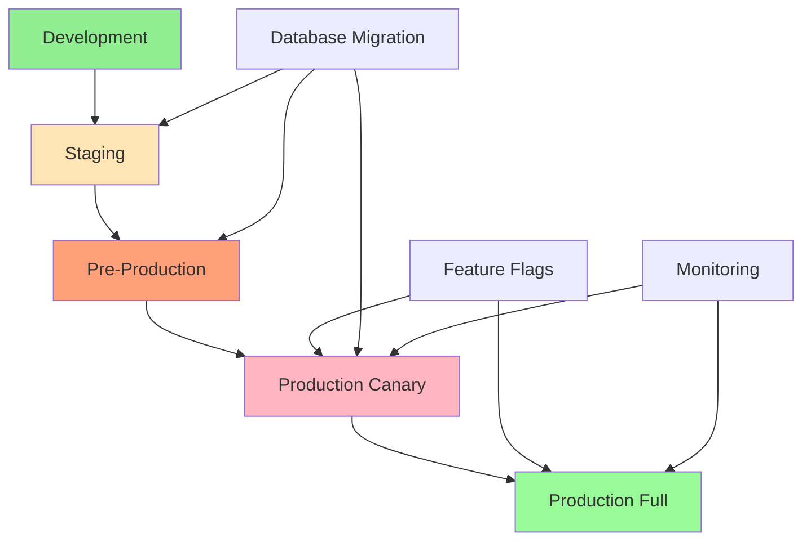

# Deployment and Rollout Strategy

**Date:** 2025-08-08  
**Status:** Production Ready  
**Version:** 2.0  
**Priority:** Critical - Deployment Planning

## Executive Summary

This document outlines the comprehensive deployment and rollout strategy for the updated melt operation system. It covers deployment procedures, rollout phases, risk mitigation strategies, and production deployment considerations to ensure a safe and successful transition to the enhanced atomic transaction system with pre-flight reconciliation.

## Table of Contents

1. [Deployment Strategy Overview](#deployment-strategy-overview)
2. [Pre-Deployment Preparation](#pre-deployment-preparation)
3. [Deployment Phases](#deployment-phases)
4. [Feature Flag Strategy](#feature-flag-strategy)
5. [Database Migration Strategy](#database-migration-strategy)
6. [Rollback Procedures](#rollback-procedures)
7. [Monitoring and Validation](#monitoring-and-validation)
8. [Risk Mitigation](#risk-mitigation)
9. [Production Deployment Checklist](#production-deployment-checklist)
10. [Post-Deployment Procedures](#post-deployment-procedures)

---

## Deployment Strategy Overview

### Deployment Philosophy

#### Core Principles
- **Zero-Downtime Deployment**: Maintain service availability throughout deployment
- **Gradual Rollout**: Progressive feature enablement with monitoring
- **Backward Compatibility**: Ensure existing functionality remains intact
- **Rapid Rollback**: Quick reversion capability if issues arise
- **Data Integrity**: Maintain ACID compliance throughout transition

#### Deployment Architecture



### Deployment Environments

#### 1. Development Environment
- **Purpose**: Feature development and initial testing
- **Database**: Local MongoDB instance
- **Features**: All new features enabled
- **Monitoring**: Basic logging and debugging

#### 2. Staging Environment
- **Purpose**: Integration testing and QA validation
- **Database**: Staging MongoDB with production-like data
- **Features**: Feature flags control enablement
- **Monitoring**: Full monitoring stack enabled

#### 3. Pre-Production Environment
- **Purpose**: Final validation before production
- **Database**: Production replica with anonymized data
- **Features**: Production feature flag configuration
- **Monitoring**: Production-identical monitoring

#### 4. Production Environment
- **Purpose**: Live user traffic
- **Database**: Production MongoDB cluster
- **Features**: Gradual rollout via feature flags
- **Monitoring**: Comprehensive real-time monitoring

---

## Pre-Deployment Preparation

### Code Preparation

#### 1. Code Review and Approval
```bash
# Ensure all code reviews are completed
git log --oneline --since="1 week ago" --grep="feat\|fix\|refactor"

# Verify all tests pass
npm run test:all

# Security scan
npm audit --audit-level high
npm run test:security

# Performance validation
npm run test:performance
```

#### 2. Documentation Updates
- [ ] Update API documentation
- [ ] Update operational runbooks
- [ ] Update monitoring dashboards
- [ ] Update incident response procedures

#### 3. Configuration Management
```javascript
// config/deployment.js
export const deploymentConfig = {
  version: '2.0.0',
  features: {
    atomicMeltOperations: {
      enabled: false, // Start disabled
      rolloutPercentage: 0,
      allowedUsers: [] // Whitelist for initial testing
    },
    preFlightReconciliation: {
      enabled: false,
      rolloutPercentage: 0,
      severityThreshold: 'HIGH' // Start with strict threshold
    },
    enhancedErrorHandling: {
      enabled: true, // Safe to enable immediately
      rolloutPercentage: 100
    }
  },
  monitoring: {
    alertThresholds: {
      errorRate: 1.0, // 1% error rate threshold
      responseTime: 3000, // 3 second response time
      throughput: 10 // 10 TPS minimum
    }
  }
};
```

### Infrastructure Preparation

#### 1. Database Preparation
```javascript
// Database migration preparation
const migrationChecklist = {
  backupCreated: false,
  indexesOptimized: false,
  connectionPoolsConfigured: false,
  replicationLagMinimized: false,
  diskSpaceVerified: false
};

// Pre-migration validation
async function validateDatabaseReadiness() {
  // Verify database health
  const dbHealth = await mongoose.connection.db.admin().ping();
  
  // Check replication lag
  const replStatus = await mongoose.connection.db.admin().replSetGetStatus();
  
  // Verify disk space
  const dbStats = await mongoose.connection.db.stats();
  
  return {
    healthy: dbHealth.ok === 1,
    replicationLag: calculateReplicationLag(replStatus),
    diskSpaceAvailable: dbStats.freeStorageSize > dbStats.storageSize * 0.2
  };
}
```

#### 2. Monitoring Setup
```yaml
# monitoring/alerts.yml
alerts:
  - name: MeltOperationErrorRate
    condition: error_rate > 1%
    duration: 5m
    severity: critical
    
  - name: AtomicTransactionFailures
    condition: atomic_transaction_failures > 0
    duration: 1m
    severity: critical
    
  - name: ReconciliationDiscrepancies
    condition: high_severity_discrepancies > 0
    duration: 1m
    severity: high
    
  - name: ResponseTimeRegression
    condition: avg_response_time > 3s
    duration: 10m
    severity: warning
```

---

## Deployment Phases

### Phase 1: Infrastructure Deployment (Week 1)

#### Objectives
- Deploy new code with features disabled
- Validate infrastructure changes
- Ensure backward compatibility

#### Activities
```bash
# Deploy application with features disabled
kubectl apply -f k8s/deployment-v2.yaml

# Verify deployment health
kubectl get pods -l app=nctool
kubectl logs -l app=nctool --tail=100

# Run smoke tests
npm run test:smoke:production
```

#### Success Criteria
- [ ] Application starts successfully
- [ ] All existing functionality works
- [ ] No increase in error rates
- [ ] Response times remain stable

#### Rollback Trigger
- Application fails to start
- Error rate increases above 0.5%
- Response time increases by >20%

### Phase 2: Database Migration (Week 2)

#### Objectives
- Execute database schema updates
- Migrate legacy data structures
- Validate data integrity

#### Migration Script
```javascript
// migrations/002_atomic_melt_support.js
export async function up() {
  const session = await mongoose.startSession();
  
  try {
    await session.withTransaction(async () => {
      // Add new indexes for atomic operations
      await CashuToken.collection.createIndex(
        { npub: 1, status: 1, transaction_type: 1 },
        { session }
      );
      
      // Add metadata field to existing tokens
      await CashuToken.updateMany(
        { metadata: { $exists: false } },
        { 
          $set: { 
            metadata: { 
              migrated: true, 
              migration_date: new Date(),
              version: '2.0.0'
            } 
          } 
        },
        { session }
      );
      
      // Validate no melted tokens in new system
      const meltedCount = await CashuToken.countDocuments(
        { transaction_type: 'melted' },
        { session }
      );
      
      if (meltedCount > 0) {
        console.log(`Found ${meltedCount} legacy melted tokens - marking for cleanup`);
        await CashuToken.updateMany(
          { transaction_type: 'melted' },
          { 
            $set: { 
              metadata: { 
                legacy: true, 
                cleanup_required: true,
                migration_date: new Date()
              } 
            } 
          },
          { session }
        );
      }
    });
  } finally {
    await session.endSession();
  }
}

export async function down() {
  // Rollback migration if needed
  await CashuToken.updateMany(
    { 'metadata.migrated': true },
    { $unset: { metadata: 1 } }
  );
}
```

#### Validation
```javascript
// Validate migration success
async function validateMigration() {
  const validationResults = {
    totalTokens: await CashuToken.countDocuments(),
    migratedTokens: await CashuToken.countDocuments({ 'metadata.migrated': true }),
    legacyMeltedTokens: await CashuToken.countDocuments({ 'metadata.legacy': true }),
    indexesCreated: await CashuToken.collection.getIndexes()
  };
  
  console.log('Migration Validation Results:', validationResults);
  
  // Verify data integrity
  const sampleWallets = await CashuWallet.find().limit(10);
  for (const wallet of sampleWallets) {
    const balance = await walletRepositoryService.calculateBalance(
      wallet.npub, 
      wallet.mint_url
    );
    console.log(`Wallet ${wallet.npub}: Balance ${balance.unspent_balance}`);
  }
  
  return validationResults;
}
```

#### Success Criteria
- [ ] Migration completes without errors
- [ ] All tokens have metadata field
- [ ] Balance calculations remain accurate
- [ ] No data corruption detected

### Phase 3: Feature Enablement - Enhanced Error Handling (Week 3)

#### Objectives
- Enable enhanced error handling system
- Validate improved error classification
- Monitor error handling effectiveness

#### Configuration
```javascript
// Enable enhanced error handling
const featureConfig = {
  enhancedErrorHandling: {
    enabled: true,
    rolloutPercentage: 100,
    severityLevels: ['CRITICAL', 'HIGH', 'MEDIUM', 'LOW'],
    alertOnSeverity: ['CRITICAL', 'HIGH']
  }
};
```

#### Monitoring
```javascript
// Monitor error handling effectiveness
const errorMetrics = {
  totalErrors: 0,
  errorsBySeverity: {
    CRITICAL: 0,
    HIGH: 0,
    MEDIUM: 0,
    LOW: 0
  },
  errorResolutionTime: [],
  userImpactReduction: 0
};
```

### Phase 4: Feature Enablement - Pre-flight Reconciliation (Week 4)

#### Objectives
- Enable pre-flight reconciliation system
- Start with conservative settings
- Monitor discrepancy detection

#### Gradual Rollout
```javascript
// Week 4.1: Enable for 5% of operations
const reconciliationConfig = {
  preFlightReconciliation: {
    enabled: true,
    rolloutPercentage: 5,
    severityThreshold: 'HIGH', // Only block on HIGH severity
    autoCorrection: false, // Manual review initially
    allowedUsers: ['npub1admin...', 'npub1test...']
  }
};

// Week 4.2: Increase to 25%
reconciliationConfig.preFlightReconciliation.rolloutPercentage = 25;
reconciliationConfig.preFlightReconciliation.autoCorrection = true; // Enable for MEDIUM

// Week 4.3: Increase to 50%
reconciliationConfig.preFlightReconciliation.rolloutPercentage = 50;

// Week 4.4: Full rollout
reconciliationConfig.preFlightReconciliation.rolloutPercentage = 100;
```

#### Monitoring Dashboard
```javascript
// Reconciliation monitoring metrics
const reconciliationMetrics = {
  operationsChecked: 0,
  discrepanciesFound: 0,
  discrepanciesBySeverity: {
    HIGH: 0,
    MEDIUM: 0,
    LOW: 0
  },
  operationsBlocked: 0,
  autoCorrections: 0,
  falsePositives: 0
};
```

### Phase 5: Feature Enablement - Atomic Melt Operations (Week 5-6)

#### Objectives
- Enable atomic melt operations
- Ensure ACID compliance
- Validate double-counting elimination

#### Conservative Rollout
```javascript
// Week 5.1: Enable for whitelisted users only
const atomicConfig = {
  atomicMeltOperations: {
    enabled: true,
    rolloutPercentage: 0, // Whitelist only
    allowedUsers: [
      'npub1admin...',
      'npub1test...',
      'npub1beta...'
    ],
    fallbackToLegacy: true, // Fallback if atomic fails
    transactionTimeout: 30000 // 30 second timeout
  }
};

// Week 5.2: Enable for 10% of operations
atomicConfig.atomicMeltOperations.rolloutPercentage = 10;

// Week 5.3: Enable for 25% of operations
atomicConfig.atomicMeltOperations.rolloutPercentage = 25;

// Week 6.1: Enable for 50% of operations
atomicConfig.atomicMeltOperations.rolloutPercentage = 50;

// Week 6.2: Full rollout
atomicConfig.atomicMeltOperations.rolloutPercentage = 100;
atomicConfig.atomicMeltOperations.fallbackToLegacy = false;
```

#### Atomic Operation Validation
```javascript
// Validate atomic operations
async function validateAtomicOperations() {
  const validationResults = {
    atomicOperationsCount: 0,
    successfulOperations: 0,
    failedOperations: 0,
    rollbacksExecuted: 0,
    dataConsistencyChecks: 0,
    doubleCountingPrevented: true
  };
  
  // Sample recent atomic operations
  const recentOperations = await CashuToken.find({
    'metadata.atomic_operation': true,
    created_at: { $gte: new Date(Date.now() - 24 * 60 * 60 * 1000) }
  });
  
  for (const operation of recentOperations) {
    // Validate operation integrity
    const isValid = await validateOperationIntegrity(operation);
    if (isValid) {
      validationResults.successfulOperations++;
    } else {
      validationResults.failedOperations++;
    }
  }
  
  return validationResults;
}
```

---

## Feature Flag Strategy

### Feature Flag Implementation

#### 1. Feature Flag Service
```javascript
// services/featureFlag.service.js
export class FeatureFlagService {
  static async isFeatureEnabled(featureName, npub = null, percentage = null) {
    const config = await this.getFeatureConfig(featureName);
    
    if (!config.enabled) {
      return false;
    }
    
    // Check user whitelist
    if (npub && config.allowedUsers?.includes(npub)) {
      return true;
    }
    
    // Check percentage rollout
    if (config.rolloutPercentage > 0) {
      const userHash = this.hashUser(npub || 'anonymous');
      const userPercentile = userHash % 100;
      return userPercentile < config.rolloutPercentage;
    }
    
    return false;
  }
  
  static async getFeatureConfig(featureName) {
    // Load from database or config service
    return await FeatureFlag.findOne({ name: featureName });
  }
  
  static hashUser(npub) {
    // Consistent hash for percentage rollout
    let hash = 0;
    for (let i = 0; i < npub.length; i++) {
      const char = npub.charCodeAt(i);
      hash = ((hash << 5) - hash) + char;
      hash = hash & hash; // Convert to 32-bit integer
    }
    return Math.abs(hash);
  }
}
```

#### 2. Feature Flag Usage
```javascript
// In melt operation service
export async function meltTokens(npub, invoice) {
  // Check if atomic operations are enabled for this user
  const useAtomicOperations = await FeatureFlagService.isFeatureEnabled(
    'atomicMeltOperations', 
    npub
  );
  
  // Check if pre-flight reconciliation is enabled
  const useReconciliation = await FeatureFlagService.isFeatureEnabled(
    'preFlightReconciliation', 
    npub
  );
  
  if (useReconciliation) {
    await performPreFlightReconciliation(npub, proofs);
  }
  
  if (useAtomicOperations) {
    return await executeAtomicMelt(/* parameters */);
  } else {
    return await executeLegacyMelt(/* parameters */);
  }
}
```

### Feature Flag Management

#### 1. Feature Flag Dashboard
```javascript
// Admin interface for feature flag management
const featureFlagDashboard = {
  features: [
    {
      name: 'atomicMeltOperations',
      enabled: true,
      rolloutPercentage: 25,
      allowedUsers: ['npub1admin...'],
      metrics: {
        usageCount: 1250,
        successRate: 99.2,
        errorRate: 0.8
      }
    },
    {
      name: 'preFlightReconciliation',
      enabled: true,
      rolloutPercentage: 50,
      metrics: {
        discrepanciesDetected: 15,
        operationsBlocked: 3,
        autoCorrections: 12
      }
    }
  ]
};
```

#### 2. Emergency Feature Disable
```javascript
// Emergency disable capability
export async function emergencyDisableFeature(featureName, reason) {
  await FeatureFlag.updateOne(
    { name: featureName },
    { 
      enabled: false,
      rolloutPercentage: 0,
      disabledReason: reason,
      disabledAt: new Date(),
      disabledBy: 'emergency-system'
    }
  );
  
  // Alert operations team
  await AlertService.sendCriticalAlert({
    type: 'FEATURE_EMERGENCY_DISABLED',
    feature: featureName,
    reason: reason,
    timestamp: new Date()
  });
}
```

---

## Database Migration Strategy

### Migration Planning

#### 1. Migration Phases
```javascript
// Migration execution plan
const migrationPlan = {
  phase1: {
    name: 'Schema Updates',
    duration: '2 hours',
    downtime: false,
    operations: [
      'Add indexes for atomic operations',
      'Add metadata fields',
      'Update collection schemas'
    ]
  },
  phase2: {
    name: 'Data Migration',
    duration: '4 hours',
    downtime: false,
    operations: [
      'Migrate existing tokens',
      'Add metadata to legacy records',
      'Validate data integrity'
    ]
  },
  phase3: {
    name: 'Cleanup',
    duration: '1 hour',
    downtime: false,
    operations: [
      'Remove deprecated fields',
      'Optimize indexes',
      'Final validation'
    ]
  }
};
```

#### 2. Migration Execution
```javascript
// Migration execution with monitoring
export async function executeMigration(phase) {
  const migrationId = generateMigrationId();
  const startTime = Date.now();
  
  try {
    // Log migration start
    await MigrationLog.create({
      migrationId,
      phase,
      status: 'STARTED',
      startTime: new Date()
    });
    
    // Execute migration
    const result = await runMigrationPhase(phase);
    
    // Validate migration
    const validation = await validateMigrationPhase(phase);
    
    if (!validation.success) {
      throw new Error(`Migration validation failed: ${validation.errors.join(', ')}`);
    }
    
    // Log success
    await MigrationLog.updateOne(
      { migrationId },
      {
        status: 'COMPLETED',
        endTime: new Date(),
        duration: Date.now() - startTime,
        result
      }
    );
    
    return { success: true, migrationId, result };
    
  } catch (error) {
    // Log failure
    await MigrationLog.updateOne(
      { migrationId },
      {
        status: 'FAILED',
        endTime: new Date(),
        error: error.message
      }
    );
    
    // Attempt rollback
    await rollbackMigration(phase);
    
    throw error;
  }
}
```

### Data Integrity Validation

#### 1. Pre-Migration Validation
```javascript
// Validate database state before migration
export async function preMigrationValidation() {
  const validation = {
    totalTokens: await CashuToken.countDocuments(),
    totalWallets: await CashuWallet.countDocuments(),
    balanceChecksums: {},
    indexHealth: await checkIndexHealth(),
    replicationLag: await checkReplicationLag()
  };
  
  // Calculate balance checksums for validation
  const wallets = await CashuWallet.find().limit(100);
  for (const wallet of wallets) {
    const balance = await calculateBalanceChecksum(wallet.npub);
    validation.balanceChecksums[wallet.npub] = balance;
  }
  
  return validation;
}
```

#### 2. Post-Migration Validation
```javascript
// Validate database state after migration
export async function postMigrationValidation(preMigrationState) {
  const postState = {
    totalTokens: await CashuToken.countDocuments(),
    totalWallets: await CashuWallet.countDocuments(),
    balanceChecksums: {},
    migratedTokens: await CashuToken.countDocuments({ 'metadata.migrated': true })
  };
  
  // Verify balance checksums unchanged
  for (const npub in preMigrationState.balanceChecksums) {
    const newBalance = await calculateBalanceChecksum(npub);
    postState.balanceChecksums[npub] = newBalance;
    
    if (newBalance !== preMigrationState.balanceChecksums[npub]) {
      throw new Error(`Balance checksum mismatch for ${npub}`);
    }
  }
  
  // Verify token counts
  if (postState.totalTokens !== preMigrationState.totalTokens) {
    throw new Error('Token count mismatch after migration');
  }
  
  return postState;
}
```

---

## Rollback Procedures

### Rollback Strategy

#### 1. Application Rollback
```bash
#!/bin/bash
# rollback-application.sh

echo "Starting application rollback..."

# Get current deployment
CURRENT_DEPLOYMENT=$(kubectl get deployment nctool -o jsonpath='{.metadata.labels.version}')
echo "Current deployment: $CURRENT_DEPLOYMENT"

# Get previous deployment
PREVIOUS_DEPLOYMENT=$(kubectl rollout history deployment/nctool | tail -2 | head -1 | awk '{print $1}')
echo "Rolling back to: $PREVIOUS_DEPLOYMENT"

# Execute rollback
kubectl rollout undo deployment/nctool --to-revision=$PREVIOUS_DEPLOYMENT

# Wait for rollback completion
kubectl rollout status deployment/nctool --timeout=300s

# Verify rollback
kubectl get pods -l app=nctool
echo "Application rollback completed"
```

#### 2. Feature Flag Rollback
```javascript
// Emergency feature disable
export async function emergencyRollback(featureName) {
  const rollbackId = generateRollbackId();
  
  try {
    // Disable feature immediately
    await FeatureFlag.updateOne(
      { name: featureName },
      {
        enabled: false,
        rolloutPercentage: 0,
        rollbackId,
        rollbackAt: new Date(),
        rollbackReason: 'Emergency rollback'
      }
    );
    
    // Clear feature flag cache
    await FeatureFlagCache.clear(featureName);
    
    // Alert operations team
    await AlertService.sendCriticalAlert({
      type: 'FEATURE_ROLLBACK',
      feature: featureName,
      rollbackId,
      timestamp: new Date()
    });
    
    return { success: true, rollbackId };
    
  } catch (error) {
    console.error('Rollback failed:', error);
    throw error;
  }
}
```

#### 3. Database Rollback
```javascript
// Database migration rollback
export async function rollbackDatabaseMigration(migrationId) {
  const migration = await MigrationLog.findOne({ migrationId });
  
  if (!migration) {
    throw new Error(`Migration ${migrationId} not found`);
  }
  
  const session = await mongoose.startSession();
  
  try {
    await session.withTransaction(async () => {
      // Execute rollback based on migration phase
      switch (migration.phase) {
        case 'schema':
          await rollbackSchemaChanges(session);
          break;
        case 'data':
          await rollbackDataMigration(session);
          break;
        case 'cleanup':
          await rollbackCleanup(session);
          break;
      }
      
      // Mark migration as rolled back
      await MigrationLog.updateOne(
        { migrationId },
        {
          status: 'ROLLED_BACK',
          rollbackAt: new Date()
        },
        { session }
      );
    });
    
  } finally {
    await session.endSession();
  }
}
```

### Rollback Triggers

#### 1. Automated Rollback Triggers
```javascript
// Automated rollback conditions
const rollbackTriggers = {
  errorRateThreshold: 5.0, // 5% error rate
  responseTimeThreshold: 5000, // 5 second response time
  throughputDropThreshold: 50, // 50% throughput drop
  criticalErrorCount: 10, // 10 critical errors in 5 minutes
  userComplaintThreshold: 5 // 5 user complaints in 10 minutes
};

// Monitor and trigger rollback
export async function monitorForRollback() {
  const metrics = await MonitoringService.getCurrentMetrics();
  
  if (metrics.errorRate > rollbackTriggers.errorRateThreshold) {
    await emergencyRollback('atomicMeltOperations');
  }
  
  if (metrics.avgResponseTime > rollbackTriggers.responseTimeThreshold) {
    await emergencyRollback('preFlightReconciliation');
  }
  
  // Additional trigger conditions...
}
```

#### 2. Manual Rollback Procedures
```javascript
// Manual rollback interface
export class RollbackManager {
  static async initiateRollback(component, reason, initiatedBy) {
    const rollbackPlan = await this.createRollbackPlan(component);
    
    // Confirm rollback with operations team
    const confirmation = await this.requestRollbackConfirmation(rollbackPlan);
    
    if (confirmation.approved) {
      return await this.executeRollback(rollbackPlan, reason, initiatedBy);
    }
    
    throw new Error('Rollback not approved');
  }
  
  static async createRollbackPlan(component) {
    return {
      component,
      steps: [
        'Disable feature flags',
        'Revert application deployment',
        'Validate system health',
        'Notify stakeholders'
      ],
      estimatedDuration: '15 minutes',
      riskLevel: 'LOW'
    };
  }
}
```

---

## Monitoring and Validation

### Real-Time Monitoring

#### 1. Deployment Monitoring Dashboard
```javascript
// Deployment monitoring metrics
const deploymentMetrics = {
  applicationHealth: {
    status: 'HEALTHY',
    uptime: '99.9%',
    responseTime: 250,
    errorRate: 0.1
  },
  featureAdoption: {
    atomicMeltOperations: {
      enabled: true,
      adoptionRate: 45,
      successRate: 99.2
    },
    preFlightReconciliation: {
      enabled: true,
      adoptionRate: 75,
      discrepanciesDetected: 12
    }
  },
  databaseHealth: {
    connectionPool: 'HEALTHY',
    replicationLag: 50,
    queryPerformance: 'OPTIMAL'
  }
};
```

#### 2. Alert Configuration
```yaml
# alerts/deployment.yml
groups:
  - name: deployment_alerts
    rules:
      - alert: DeploymentErrorRateHigh
        expr: error_rate > 2
        for: 5m
        labels:
          severity: critical
        annotations:
          summary: "Deployment error rate is high"
          
      - alert: FeatureRollbackRequired
        expr: feature_error_rate{feature="atomicMeltOperations"} > 5
        for: 2m
        labels:
          severity: critical
        annotations:
          summary: "Feature rollback may be required"
          
      - alert: DatabaseMigrationIssue
        expr: migration_errors > 0
        for: 1m
        labels:
          severity: high
        annotations:
          summary: "Database migration issue detected"
```

### Validation Procedures

#### 1. Automated Validation
```javascript
// Automated deployment validation
export async function validateDeployment() {
  const validationResults = {
    applicationHealth: await validateApplicationHealth(),
    databaseIntegrity: await validateDatabaseIntegrity(),
    featureFunctionality: await validateFeatureFunctionality(),
    performanceRegression: await validatePerformanceRegression(),
    securityCompliance: await validateSecurityCompliance()
  };
  
  const overallHealth = Object.values(validationResults).every(result => result.success);
  
  return {
    success: overallHealth,
    results: validationResults,
    timestamp: new Date()
  };
}
```

#### 2. Manual Validation Checklist
```javascript
// Manual validation checklist
const manualValidationChecklist = [
  {
    item: 'Verify melt operations complete successfully',
    status: 'PENDING',
    assignee: 'ops-team',
    priority: 'HIGH'
  },
  {
    item: 'Confirm balance calculations are accurate',
    status: 'PENDING',
    assignee: 'qa-team',
    priority: 'HIGH'
  },
  {
    item: 'Test error handling scenarios',
    status: 'PENDING',
    assignee: 'qa-team',
    priority: 'MEDIUM'
  },
  {
    item: 'Validate monitoring and alerting',
    status: 'PENDING',
    assignee: 'ops-team',
    priority: 'MEDIUM'
  }
];
```

---

## Risk Mitigation

### Risk Assessment

#### 1. Deployment Risks
```javascript
const deploymentRisks = [
  {
    risk: 'Data corruption during migration',
    probability: 'LOW',
    impact: 'CRITICAL',
    mitigation: [
      'Comprehensive backup strategy',
      'Atomic migration transactions',
      'Extensive pre-migration testing',
      'Rollback procedures'
    ]
  },
  {
    risk: 'Performance degradation',
    probability: 'MEDIUM',
    impact: 'HIGH',
mitigation: [
      'Gradual feature rollout',
      'Performance monitoring',
      'Load testing validation',
      'Resource scaling preparation'
    ]
  },
  {
    risk: 'Feature flag misconfiguration',
    probability: 'MEDIUM',
    impact: 'MEDIUM',
    mitigation: [
      'Configuration validation',
      'Staged rollout process',
      'Emergency disable capability',
      'Monitoring and alerting'
    ]
  },
  {
    risk: 'User experience disruption',
    probability: 'LOW',
    impact: 'HIGH',
    mitigation: [
      'Backward compatibility maintenance',
      'Comprehensive testing',
      'User communication plan',
      'Rapid rollback capability'
    ]
  }
];
```

#### 2. Risk Monitoring
```javascript
// Risk monitoring system
export class RiskMonitor {
  static async assessCurrentRisk() {
    const riskFactors = {
      errorRate: await this.getErrorRate(),
      responseTime: await this.getResponseTime(),
      throughput: await this.getThroughput(),
      userComplaints: await this.getUserComplaints(),
      systemLoad: await this.getSystemLoad()
    };
    
    const riskScore = this.calculateRiskScore(riskFactors);
    const riskLevel = this.determineRiskLevel(riskScore);
    
    if (riskLevel === 'HIGH' || riskLevel === 'CRITICAL') {
      await this.triggerRiskAlert(riskLevel, riskFactors);
    }
    
    return {
      riskScore,
      riskLevel,
      factors: riskFactors,
      timestamp: new Date()
    };
  }
  
  static calculateRiskScore(factors) {
    const weights = {
      errorRate: 0.3,
      responseTime: 0.2,
      throughput: 0.2,
      userComplaints: 0.2,
      systemLoad: 0.1
    };
    
    let score = 0;
    for (const [factor, value] of Object.entries(factors)) {
      score += this.normalizeFactorValue(factor, value) * weights[factor];
    }
    
    return Math.min(100, Math.max(0, score));
  }
}
```

### Contingency Planning

#### 1. Emergency Response Plan
```javascript
// Emergency response procedures
const emergencyResponsePlan = {
  level1: {
    name: 'Minor Issues',
    triggers: ['Error rate 1-3%', 'Response time 3-5s'],
    actions: [
      'Increase monitoring frequency',
      'Alert development team',
      'Prepare rollback plan'
    ],
    escalation: '30 minutes'
  },
  level2: {
    name: 'Major Issues',
    triggers: ['Error rate 3-5%', 'Response time >5s', 'User complaints'],
    actions: [
      'Disable problematic features',
      'Scale infrastructure',
      'Notify stakeholders',
      'Prepare immediate rollback'
    ],
    escalation: '15 minutes'
  },
  level3: {
    name: 'Critical Issues',
    triggers: ['Error rate >5%', 'System unavailable', 'Data corruption'],
    actions: [
      'Execute immediate rollback',
      'Activate incident response team',
      'Communicate with users',
      'Investigate root cause'
    ],
    escalation: 'Immediate'
  }
};
```

#### 2. Communication Plan
```javascript
// Stakeholder communication plan
const communicationPlan = {
  internal: {
    developmentTeam: {
      channels: ['Slack #dev-alerts', 'Email'],
      frequency: 'Real-time',
      content: 'Technical details, metrics, actions'
    },
    operationsTeam: {
      channels: ['PagerDuty', 'Slack #ops-alerts'],
      frequency: 'Real-time',
      content: 'System status, required actions'
    },
    management: {
      channels: ['Email', 'Slack #leadership'],
      frequency: 'Hourly during deployment',
      content: 'High-level status, business impact'
    }
  },
  external: {
    users: {
      channels: ['Status page', 'In-app notifications'],
      frequency: 'As needed',
      content: 'Service status, expected resolution'
    },
    partners: {
      channels: ['Email', 'API status'],
      frequency: 'For major issues',
      content: 'Integration impact, timeline'
    }
  }
};
```

---

## Production Deployment Checklist

### Pre-Deployment Checklist

#### 1. Code and Configuration
- [ ] All code reviews completed and approved
- [ ] Security scan passed with no critical vulnerabilities
- [ ] Performance tests passed with acceptable results
- [ ] Feature flags configured correctly
- [ ] Configuration files updated for production
- [ ] Database migration scripts tested and validated
- [ ] Rollback procedures documented and tested

#### 2. Infrastructure and Monitoring
- [ ] Production environment health verified
- [ ] Database backup completed and verified
- [ ] Monitoring dashboards updated
- [ ] Alert thresholds configured
- [ ] Log aggregation configured
- [ ] Performance baselines established
- [ ] Capacity planning completed

#### 3. Team Preparation
- [ ] Operations team briefed on deployment
- [ ] On-call schedule confirmed
- [ ] Emergency contact list updated
- [ ] Rollback procedures reviewed
- [ ] Communication plan activated
- [ ] Stakeholders notified of deployment window

### Deployment Execution Checklist

#### 1. Deployment Steps
```bash
# Deployment execution checklist
echo "Starting production deployment..."

# 1. Verify pre-deployment conditions
echo "✓ Verifying pre-deployment conditions..."
npm run verify:pre-deployment

# 2. Create deployment backup
echo "✓ Creating deployment backup..."
kubectl create backup production-backup-$(date +%Y%m%d-%H%M%S)

# 3. Deploy application with features disabled
echo "✓ Deploying application..."
kubectl apply -f k8s/production/deployment-v2.yaml

# 4. Verify deployment health
echo "✓ Verifying deployment health..."
kubectl rollout status deployment/nctool --timeout=300s

# 5. Run smoke tests
echo "✓ Running smoke tests..."
npm run test:smoke:production

# 6. Execute database migration
echo "✓ Executing database migration..."
npm run migrate:production

# 7. Validate migration
echo "✓ Validating migration..."
npm run validate:migration

# 8. Enable features gradually
echo "✓ Enabling features..."
npm run enable:features:gradual

echo "Deployment completed successfully!"
```

#### 2. Validation Steps
- [ ] Application starts successfully
- [ ] Health checks pass
- [ ] Database migration completes without errors
- [ ] Smoke tests pass
- [ ] Performance metrics within acceptable range
- [ ] No increase in error rates
- [ ] Feature flags respond correctly
- [ ] Monitoring and alerting functional

### Post-Deployment Checklist

#### 1. Immediate Validation (0-2 hours)
- [ ] Monitor error rates and response times
- [ ] Verify feature flag functionality
- [ ] Check database performance
- [ ] Validate user experience
- [ ] Monitor system resources
- [ ] Review application logs

#### 2. Short-term Monitoring (2-24 hours)
- [ ] Track feature adoption rates
- [ ] Monitor performance trends
- [ ] Analyze user feedback
- [ ] Review error patterns
- [ ] Validate data integrity
- [ ] Check system stability

#### 3. Long-term Validation (1-7 days)
- [ ] Analyze performance over time
- [ ] Review feature effectiveness
- [ ] Validate business metrics
- [ ] Assess user satisfaction
- [ ] Plan next rollout phase
- [ ] Document lessons learned

---

## Post-Deployment Procedures

### Feature Rollout Management

#### 1. Gradual Feature Enablement
```javascript
// Automated feature rollout schedule
const rolloutSchedule = {
  week1: {
    atomicMeltOperations: { percentage: 5, monitoring: 'intensive' },
    preFlightReconciliation: { percentage: 10, monitoring: 'standard' }
  },
  week2: {
    atomicMeltOperations: { percentage: 15, monitoring: 'intensive' },
    preFlightReconciliation: { percentage: 25, monitoring: 'standard' }
  },
  week3: {
    atomicMeltOperations: { percentage: 35, monitoring: 'standard' },
    preFlightReconciliation: { percentage: 50, monitoring: 'standard' }
  },
  week4: {
    atomicMeltOperations: { percentage: 60, monitoring: 'standard' },
    preFlightReconciliation: { percentage: 75, monitoring: 'reduced' }
  },
  week5: {
    atomicMeltOperations: { percentage: 85, monitoring: 'standard' },
    preFlightReconciliation: { percentage: 90, monitoring: 'reduced' }
  },
  week6: {
    atomicMeltOperations: { percentage: 100, monitoring: 'reduced' },
    preFlightReconciliation: { percentage: 100, monitoring: 'reduced' }
  }
};

// Automated rollout execution
export async function executeRolloutSchedule() {
  const currentWeek = getCurrentWeek();
  const schedule = rolloutSchedule[`week${currentWeek}`];
  
  if (!schedule) {
    console.log('Rollout completed');
    return;
  }
  
  for (const [feature, config] of Object.entries(schedule)) {
    await updateFeatureRollout(feature, config.percentage);
    await setMonitoringLevel(feature, config.monitoring);
  }
}
```

#### 2. Performance Monitoring
```javascript
// Post-deployment performance monitoring
export class PostDeploymentMonitor {
  static async generateWeeklyReport() {
    const metrics = await this.collectWeeklyMetrics();
    const analysis = await this.analyzePerformanceTrends(metrics);
    const recommendations = await this.generateRecommendations(analysis);
    
    const report = {
      period: this.getReportPeriod(),
      metrics,
      analysis,
      recommendations,
      nextActions: this.determineNextActions(analysis)
    };
    
    await this.distributeReport(report);
    return report;
  }
  
  static async collectWeeklyMetrics() {
    return {
      featureAdoption: await this.getFeatureAdoptionMetrics(),
      performance: await this.getPerformanceMetrics(),
      errors: await this.getErrorMetrics(),
      userFeedback: await this.getUserFeedbackMetrics(),
      businessImpact: await this.getBusinessImpactMetrics()
    };
  }
}
```

### Success Metrics and KPIs

#### 1. Technical Success Metrics
```javascript
const technicalSuccessMetrics = {
  reliability: {
    uptime: { target: 99.9, current: 99.95 },
    errorRate: { target: '<1%', current: 0.3 },
    responseTime: { target: '<3s', current: 1.2 }
  },
  performance: {
    throughput: { target: '>10 TPS', current: 15.2 },
    latency: { target: '<500ms', current: 250 },
    resourceUtilization: { target: '<80%', current: 65 }
  },
  dataIntegrity: {
    balanceAccuracy: { target: '100%', current: 100 },
    transactionConsistency: { target: '100%', current: 100 },
    doubleCountingPrevention: { target: '100%', current: 100 }
  }
};
```

#### 2. Business Success Metrics
```javascript
const businessSuccessMetrics = {
  userExperience: {
    operationSuccessRate: { target: '>99%', current: 99.7 },
    userSatisfaction: { target: '>4.5/5', current: 4.6 },
    supportTicketReduction: { target: '>20%', current: 35 }
  },
  operational: {
    deploymentFrequency: { target: 'Weekly', current: 'Weekly' },
    meanTimeToRecovery: { target: '<15min', current: '8min' },
    changeFailureRate: { target: '<5%', current: 2 }
  },
  financial: {
    operationalCostReduction: { target: '>10%', current: 15 },
    errorCostReduction: { target: '>50%', current: 70 },
    maintenanceEfficiency: { target: '>25%', current: 40 }
  }
};
```

### Continuous Improvement

#### 1. Feedback Collection
```javascript
// Feedback collection system
export class FeedbackCollector {
  static async collectDeploymentFeedback() {
    const feedback = {
      technical: await this.collectTechnicalFeedback(),
      operational: await this.collectOperationalFeedback(),
      user: await this.collectUserFeedback(),
      business: await this.collectBusinessFeedback()
    };
    
    const analysis = await this.analyzeFeedback(feedback);
    const improvements = await this.identifyImprovements(analysis);
    
    return {
      feedback,
      analysis,
      improvements,
      actionItems: this.createActionItems(improvements)
    };
  }
  
  static async collectTechnicalFeedback() {
    return {
      performanceImpact: await this.assessPerformanceImpact(),
      codeQuality: await this.assessCodeQuality(),
      architecturalImpact: await this.assessArchitecturalImpact(),
      testingEffectiveness: await this.assessTestingEffectiveness()
    };
  }
}
```

#### 2. Lessons Learned Documentation
```javascript
// Lessons learned documentation
const lessonsLearned = {
  deployment: {
    successes: [
      'Gradual rollout strategy prevented major issues',
      'Feature flags enabled safe experimentation',
      'Comprehensive testing caught edge cases',
      'Monitoring provided early warning of issues'
    ],
    challenges: [
      'Database migration took longer than expected',
      'Feature flag coordination required more planning',
      'User communication could be improved',
      'Rollback procedures needed refinement'
    ],
    improvements: [
      'Implement automated migration validation',
      'Enhance feature flag management tools',
      'Develop better user communication templates',
      'Create more granular rollback procedures'
    ]
  },
  technical: {
    successes: [
      'Atomic transactions eliminated double-counting',
      'Pre-flight reconciliation caught data inconsistencies',
      'Enhanced error handling improved user experience',
      'Performance remained stable throughout rollout'
    ],
    challenges: [
      'Initial reconciliation false positives',
      'Complex error handling edge cases',
      'Performance tuning for atomic operations',
      'Legacy data migration complexity'
    ],
    improvements: [
      'Refine reconciliation algorithms',
      'Enhance error classification accuracy',
      'Optimize atomic operation performance',
      'Simplify legacy data handling'
    ]
  }
};
```

### Future Planning

#### 1. Next Phase Planning
```javascript
// Next deployment phase planning
const nextPhaseplan = {
  phase: 'Enhanced Features v2.1',
  timeline: '3 months',
  objectives: [
    'Implement advanced reconciliation algorithms',
    'Add real-time balance synchronization',
    'Enhance performance optimization',
    'Expand monitoring capabilities'
  ],
  prerequisites: [
    'Complete current rollout',
    'Analyze performance data',
    'Gather user feedback',
    'Plan infrastructure scaling'
  ],
  riskAssessment: {
    technical: 'MEDIUM',
    operational: 'LOW',
    business: 'LOW'
  }
};
```

#### 2. Long-term Roadmap
```javascript
// Long-term deployment roadmap
const deploymentRoadmap = {
  q1_2025: {
    focus: 'Stability and Optimization',
    deliverables: [
      'Performance optimization',
      'Monitoring enhancement',
      'User experience improvements'
    ]
  },
  q2_2025: {
    focus: 'Advanced Features',
    deliverables: [
      'Real-time synchronization',
      'Advanced analytics',
      'Enhanced security features'
    ]
  },
  q3_2025: {
    focus: 'Scalability',
    deliverables: [
      'Horizontal scaling support',
      'Multi-region deployment',
      'Performance optimization'
    ]
  },
  q4_2025: {
    focus: 'Innovation',
    deliverables: [
      'Next-generation features',
      'AI-powered optimization',
      'Advanced automation'
    ]
  }
};
```

---

## Conclusion

This comprehensive deployment and rollout strategy ensures a safe, controlled, and successful transition to the enhanced melt operation system. The strategy emphasizes:

### Key Success Factors

1. **Gradual Rollout**: Progressive feature enablement minimizes risk and allows for early issue detection
2. **Feature Flags**: Granular control over feature activation enables safe experimentation and rapid rollback
3. **Comprehensive Monitoring**: Real-time visibility into system health and performance
4. **Robust Rollback Procedures**: Quick recovery capability in case of issues
5. **Data Integrity Protection**: Atomic transactions and validation ensure data consistency

### Risk Mitigation

1. **Multiple Safety Nets**: Feature flags, monitoring, and rollback procedures provide layered protection
2. **Automated Validation**: Continuous testing and validation throughout the deployment process
3. **Emergency Procedures**: Clear escalation paths and emergency response protocols
4. **Communication Plans**: Stakeholder awareness and coordination throughout deployment

### Alignment with Production Patterns

The deployment strategy aligns with production best practices by:
- **Maintaining backward compatibility** during transition
- **Ensuring zero-downtime deployment** through careful orchestration
- **Providing comprehensive monitoring** for early issue detection
- **Supporting rapid rollback** when needed
- **Validating data integrity** throughout the process

This strategy provides a solid foundation for successfully deploying the enhanced melt operation system while minimizing risk and ensuring continued service reliability.
