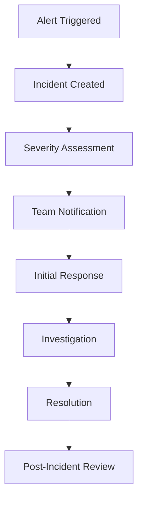
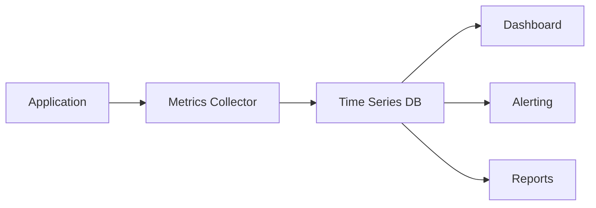

# Operational Runbooks for Melt Operations

**Date:** 2025-08-08  
**Status:** Production Ready  
**Version:** 2.0  
**Priority:** Critical - Operations Guide

## Executive Summary

This document provides comprehensive operational runbooks for monitoring, troubleshooting, and maintaining the updated melt operation system. These runbooks are designed for operations teams, support engineers, and developers responsible for maintaining system reliability.

## Table of Contents

1. [Monitoring and Observability](#monitoring-and-observability)
2. [Alert Definitions and Responses](#alert-definitions-and-responses)
3. [Troubleshooting Common Issues](#troubleshooting-common-issues)
4. [Recovery Procedures](#recovery-procedures)
5. [Performance Monitoring](#performance-monitoring)
6. [Health Checks and Diagnostics](#health-checks-and-diagnostics)
7. [Incident Response Procedures](#incident-response-procedures)
8. [Maintenance Procedures](#maintenance-procedures)
9. [Escalation Procedures](#escalation-procedures)
10. [Operational Metrics](#operational-metrics)

---

## Monitoring and Observability

### Key Metrics to Monitor

#### 1. Melt Operation Metrics

**Primary KPIs:**
- **Melt Success Rate**: Target >99.5%
- **Average Operation Duration**: Target <3 seconds
- **Pre-flight Reconciliation Success Rate**: Target >99.9%
- **Atomic Transaction Success Rate**: Target >99.99%

**Secondary KPIs:**
- **Proof State Discrepancy Rate**: Monitor for trends
- **Error Classification Distribution**: Track severity levels
- **Recovery Success Rate**: Target >95% for recoverable errors

#### 2. Database Performance Metrics

**Transaction Metrics:**
- **MongoDB Transaction Duration**: Target <500ms
- **Transaction Rollback Rate**: Target <0.1%
- **Connection Pool Utilization**: Target <80%
- **Query Performance**: Index hit ratio >95%

**Data Integrity Metrics:**
- **Balance Calculation Accuracy**: 100% consistency required
- **Token Status Consistency**: No orphaned tokens
- **Audit Trail Completeness**: 100% coverage

#### 3. External Dependencies

**Mint Connectivity:**
- **Mint Response Time**: Target <2 seconds
- **Mint Availability**: Target >99.9%
- **Proof State Check Duration**: Target <1 second
- **Lightning Payment Success Rate**: Monitor for trends

### Monitoring Implementation

#### Application Metrics Collection
```javascript
// Example monitoring integration
class MeltOperationMonitoring {
  static trackMeltAttempt(npub, amount, invoice) {
    metrics.increment('melt.attempts.total', {
      npub_hash: this.hashNpub(npub),
      amount_range: this.getAmountRange(amount)
    });
    
    this.startTimer('melt.operation.duration', { npub_hash: this.hashNpub(npub) });
  }
  
  static trackMeltSuccess(npub, transactionId, result) {
    metrics.increment('melt.success.total', {
      npub_hash: this.hashNpub(npub),
      change_amount: result.changeAmount > 0 ? 'with_change' : 'no_change'
    });
    
    this.endTimer('melt.operation.duration', { npub_hash: this.hashNpub(npub) });
    
    // Track atomic operation details
    metrics.histogram('melt.atomic.operations.count', result.atomicResult.operations.length);
    metrics.histogram('melt.change.amount', result.changeAmount);
  }
  
  static trackMeltFailure(npub, error, severity) {
    metrics.increment('melt.failures.total', {
      npub_hash: this.hashNpub(npub),
      error_code: error.code || 'unknown',
      severity: severity || 'unknown'
    });
    
    // Track critical errors separately
    if (severity === 'CRITICAL') {
      metrics.increment('melt.critical_errors.total', {
        error_code: error.code
      });
    }
  }
}
```

#### Log Aggregation Queries

**Successful Operations:**
```bash
# Search for successful melt operations
grep "Enhanced melt tokens operation completed successfully" /var/log/app.log | \
  jq '.npub, .transactionId, .operationDuration' | \
  head -20
```

**Error Analysis:**
```bash
# Search for critical errors
grep "CRITICAL:" /var/log/app.log | \
  jq '.timestamp, .error, .severity, .requiresManualIntervention' | \
  tail -50
```

**Pre-flight Reconciliation Issues:**
```bash
# Search for reconciliation blocks
grep "Pre-flight reconciliation BLOCKED" /var/log/app.log | \
  jq '.npub, .discrepancies, .reconciliationResult' | \
  tail -20
```

---

## Alert Definitions and Responses

### Critical Alerts (P0 - Immediate Response Required)

#### 1. Critical Melt Operation Failures
**Alert Condition:**
```yaml
alert: CriticalMeltFailures
expr: rate(melt_critical_errors_total[5m]) > 0
for: 0m
severity: critical
description: "Critical melt operation failures detected"
```

**Response Procedure:**
1. **Immediate Actions (0-5 minutes):**
   - Check application logs for CRITICAL errors
   - Verify mint connectivity and status
   - Check MongoDB cluster health
   - Disable melt operations if widespread failures

2. **Investigation (5-15 minutes):**
   - Identify affected users and transactions
   - Check for database transaction rollbacks
   - Verify Lightning payment status for failed operations
   - Review error patterns and root causes

3. **Resolution (15-60 minutes):**
   - Contact mint provider if connectivity issues
   - Execute manual recovery procedures if needed
   - Update monitoring thresholds if false positive
   - Communicate with affected users

#### 2. Database Transaction Failures
**Alert Condition:**
```yaml
alert: DatabaseTransactionFailures
expr: rate(mongodb_transaction_rollbacks_total[5m]) > 0.01
for: 2m
severity: critical
description: "High database transaction rollback rate"
```

**Response Procedure:**
1. **Check MongoDB cluster status**
2. **Review transaction logs for patterns**
3. **Verify connection pool health**
4. **Check for deadlocks or long-running transactions**
5. **Scale database resources if needed**

#### 3. Proof State Reconciliation Failures
**Alert Condition:**
```yaml
alert: ProofStateReconciliationFailures
expr: rate(proof_reconciliation_blocked_total[5m]) > 0.1
for: 1m
severity: critical
description: "High rate of proof state reconciliation blocks"
```

**Response Procedure:**
1. **Check mint connectivity and response times**
2. **Review proof state discrepancy patterns**
3. **Verify database consistency**
4. **Check for mint-side issues or maintenance**
5. **Execute manual reconciliation if needed**

### High Priority Alerts (P1 - Response within 30 minutes)

#### 1. Melt Operation Success Rate Drop
**Alert Condition:**
```yaml
alert: MeltSuccessRateDrop
expr: rate(melt_success_total[10m]) / rate(melt_attempts_total[10m]) < 0.95
for: 5m
severity: high
description: "Melt operation success rate below 95%"
```

#### 2. High Operation Duration
**Alert Condition:**
```yaml
alert: HighMeltOperationDuration
expr: histogram_quantile(0.95, rate(melt_operation_duration_bucket[5m])) > 5
for: 3m
severity: high
description: "95th percentile melt operation duration above 5 seconds"
```

### Medium Priority Alerts (P2 - Response within 2 hours)

#### 1. Proof State Discrepancies
**Alert Condition:**
```yaml
alert: ProofStateDiscrepancies
expr: rate(proof_discrepancies_total[30m]) > 0.05
for: 10m
severity: medium
description: "Elevated proof state discrepancy rate"
```

#### 2. Balance Calculation Inconsistencies
**Alert Condition:**
```yaml
alert: BalanceInconsistencies
expr: rate(balance_calculation_errors_total[1h]) > 0
for: 5m
severity: medium
description: "Balance calculation inconsistencies detected"
```

---

## Troubleshooting Common Issues

### Issue 1: Melt Operation Timeouts

#### Symptoms:
- Operations taking longer than 10 seconds
- Client timeout errors
- Incomplete transactions

#### Diagnosis Steps:
```bash
# Check operation duration distribution
grep "operationDuration" /var/log/app.log | \
  jq '.operationDuration' | \
  sort -n | \
  tail -20

# Check mint response times
grep "Mint connectivity test" /var/log/app.log | \
  jq '.tests.mintInfo.duration, .tests.cashuLibrary.duration'

# Check database query performance
db.cashuTokens.explain("executionStats").find({npub: "...", status: "unspent"})
```

#### Resolution Steps:
1. **Check mint connectivity:**
   ```bash
   curl -w "@curl-format.txt" -o /dev/null -s "https://mint.minibits.cash/Bitcoin/v1/info"
   ```

2. **Verify database performance:**
   ```javascript
   // Check for missing indexes
   db.cashuTokens.getIndexes()
   
   // Check slow queries
   db.setProfilingLevel(2, { slowms: 1000 })
   db.system.profile.find().sort({ts: -1}).limit(5)
   ```

3. **Optimize connection pools:**
   ```javascript
   // Increase connection pool size
   mongoose.connect(uri, {
     maxPoolSize: 20,
     minPoolSize: 5
   });
   ```

### Issue 2: Proof State Discrepancies

#### Symptoms:
- Operations blocked by pre-flight reconciliation
- HIGH severity discrepancy alerts
- Users unable to perform melt operations

#### Diagnosis Steps:
```bash
# Check discrepancy patterns
grep "HIGH severity discrepancies detected" /var/log/app.log | \
  jq '.discrepancies[] | select(.severity == "HIGH")' | \
  head -10

# Check mint proof state responses
grep "Mint proof state check" /var/log/app.log | \
  jq '.mintStates, .dbStates' | \
  head -5
```

#### Resolution Steps:
1. **Manual proof state verification:**
   ```bash
   # Use API to check specific proof states
   curl -X GET "http://localhost:3000/api/wallet/{npub}/proofs/status" \
     -H "Content-Type: application/json"
   ```

2. **Database state correction:**
   ```javascript
   // Mark tokens as spent if mint shows them as spent
   db.cashuTokens.updateMany(
     { "proofs.secret": { $in: ["secret1", "secret2"] } },
     { $set: { status: "spent", spent_at: new Date() } }
   );
   ```

3. **Mint connectivity verification:**
   ```bash
   # Test mint endpoints
   curl "https://mint.minibits.cash/Bitcoin/v1/checkstate" \
     -X POST \
     -H "Content-Type: application/json" \
     -d '{"Ys": ["proof_y_value"]}'
   ```

### Issue 3: Atomic Transaction Failures

#### Symptoms:
- Database rollbacks
- Partial state updates
- Data inconsistency errors

#### Diagnosis Steps:
```bash
# Check transaction failure patterns
grep "Atomic melt transaction failed" /var/log/app.log | \
  jq '.error, .transaction_id, .source_token_ids' | \
  head -10

# Check MongoDB transaction logs
grep "transaction" /var/log/mongodb/mongod.log | \
  grep -E "(abort|rollback)" | \
  tail -20
```

#### Resolution Steps:
1. **Check MongoDB cluster health:**
   ```javascript
   // Check replica set status
   rs.status()
   
   // Check for write concern issues
   db.runCommand({getLastError: 1, w: "majority", wtimeout: 5000})
   ```

2. **Verify session handling:**
   ```javascript
   // Check for session leaks
   db.runCommand({currentOp: true, $all: true})
   ```

3. **Review transaction timeouts:**
   ```javascript
   // Increase transaction timeout if needed
   await session.withTransaction(
     async () => { /* operations */ },
     { maxTimeMS: 30000 }
   );
   ```

### Issue 4: Balance Calculation Errors

#### Symptoms:
- Incorrect balance displays
- Double-counting detected
- Audit trail inconsistencies

#### Diagnosis Steps:
```bash
# Check balance calculation logs
grep "Balance calculation" /var/log/app.log | \
  jq '.npub, .unspent_balance, .spent_balance, .total_balance' | \
  head -10

# Check for melted token documents (should be zero)
db.cashuTokens.count({transaction_type: "melted"})
```

#### Resolution Steps:
1. **Verify no melted tokens exist:**
   ```javascript
   // Check for problematic melted tokens
   db.cashuTokens.find({transaction_type: "melted"}).count()
   
   // If found, investigate and remove
   db.cashuTokens.find({transaction_type: "melted"}).forEach(
     doc => print(`Found melted token: ${doc._id}`)
   );
   ```

2. **Recalculate balances:**
   ```javascript
   // Manual balance verification
   const unspent = db.cashuTokens.aggregate([
     {$match: {npub: "...", status: "unspent"}},
     {$group: {_id: null, total: {$sum: "$total_amount"}}}
   ]);
   
   const spent = db.cashuTokens.aggregate([
     {$match: {npub: "...", status: "spent"}},
     {$group: {_id: null, total: {$sum: "$total_amount"}}}
   ]);
   ```

3. **Check for duplicate proofs:**
   ```javascript
   // Find duplicate proof secrets
   db.cashuTokens.aggregate([
     {$unwind: "$proofs"},
     {$group: {
       _id: "$proofs.secret",
       count: {$sum: 1},
       tokens: {$push: "$_id"}
     }},
     {$match: {count: {$gt: 1}}}
   ]);
   ```

---

## Recovery Procedures

### Critical Error Recovery

#### Scenario 1: Mint Success + Database Failure
**Error Code:** `CRITICAL_DB_FAILURE_AFTER_MINT_SUCCESS`

**Recovery Steps:**
1. **Immediate Assessment:**
   ```bash
   # Find affected transactions
   grep "CRITICAL_DB_FAILURE_AFTER_MINT_SUCCESS" /var/log/app.log | \
     jq '.quoteId, .transactionId, .npub' | \
     tail -10
   ```

2. **Verify Lightning Payment Status:**
   ```bash
   # Check Lightning payment completion
   # Use mint API or Lightning node to verify payment
   curl "https://mint.minibits.cash/Bitcoin/v1/melt/quote/{quoteId}"
   ```

3. **Manual Database Correction:**
   ```javascript
   // Mark source tokens as spent
   db.cashuTokens.updateMany(
     {_id: {$in: [ObjectId("..."), ObjectId("...")]}},
     {$set: {status: "spent", spent_at: new Date()}}
   );
   
   // Create change tokens if applicable
   db.cashuTokens.insertOne({
     npub: "...",
     wallet_id: ObjectId("..."),
     proofs: [...], // Keep proofs
     transaction_type: "change",
     transaction_id: "manual_recovery_...",
     status: "unspent",
     metadata: {
       source: "manual_recovery",
       original_transaction_id: "...",
       recovery_reason: "CRITICAL_DB_FAILURE_AFTER_MINT_SUCCESS"
     }
   });
   ```

#### Scenario 2: Proof State Reconciliation Deadlock
**Error Code:** `HIGH_SEVERITY_DISCREPANCIES`

**Recovery Steps:**
1. **Identify Affected Proofs:**
   ```bash
   # Find blocked operations
   grep "HIGH_SEVERITY_DISCREPANCIES" /var/log/app.log | \
     jq '.discrepancies[] | select(.severity == "HIGH")' | \
     head -5
   ```

2. **Manual State Correction:**
   ```javascript
   // Update database to match mint truth
   const affectedSecrets = ["secret1", "secret2"];
   
   db.cashuTokens.updateMany(
     {"proofs.secret": {$in: affectedSecrets}},
     {$set: {status: "spent", spent_at: new Date()}}
   );
   ```

3. **Verify Correction:**
   ```bash
   # Test proof state check after correction
   curl -X GET "http://localhost:3000/api/wallet/{npub}/proofs/status" \
     -H "Content-Type: application/json"
   ```

### Automated Recovery Procedures

#### Recovery Service Implementation
```javascript
class RecoveryService {
  static async recoverStuckTransactions(npub, options = {}) {
    const { dryRun = false, maxAge = 3600000 } = options; // 1 hour default
    
    // Find stuck transactions
    const cutoff = new Date(Date.now() - maxAge);
    const stuckTransactions = await CashuToken.find({
      npub,
      status: "pending",
      created_at: { $lt: cutoff }
    });
    
    const results = {
      processed: 0,
      recovered: 0,
      failed: 0,
      details: []
    };
    
    for (const transaction of stuckTransactions) {
      try {
        results.processed++;
        
        if (dryRun) {
          results.details.push({
            transactionId: transaction.transaction_id,
            action: "would_recover",
            reason: "stuck_pending"
          });
          continue;
        }
        
        // Attempt recovery
        const recoveryResult = await this.recoverTransaction(transaction);
        
        if (recoveryResult.success) {
          results.recovered++;
          results.details.push({
            transactionId: transaction.transaction_id,
            action: "recovered",
            method: recoveryResult.method
          });
        } else {
          results.failed++;
          results.details.push({
            transactionId: transaction.transaction_id,
            action: "failed",
            error: recoveryResult.error
          });
        }
        
      } catch (error) {
        results.failed++;
        results.details.push({
          transactionId: transaction.transaction_id,
          action: "failed",
          error: error.message
        });
      }
    }
    
    return results;
  }
}
```

---

## Performance Monitoring

### Performance Baselines

#### Operation Duration Targets
- **Pre-flight Reconciliation**: <500ms (95th percentile)
- **Token Selection**: <100ms (95th percentile)
- **Mint Operations**: <2000ms (95th percentile)
- **Atomic Database Update**: <300ms (95th percentile)
- **Total Melt Operation**: <3000ms (95th percentile)

#### Database Performance Targets
- **Query Response Time**: <100ms (95th percentile)
- **Transaction Duration**: <500ms (95th percentile)
- **Connection Pool Utilization**: <80%
- **Index Hit Ratio**: >95%

### Performance Monitoring Queries

#### Database Performance Analysis
```javascript
// Check slow queries
db.setProfilingLevel(2, { slowms: 100 });

// Analyze query patterns
db.system.profile.aggregate([
  { $match: { ts: { $gte: new Date(Date.now() - 3600000) } } },
  { $group: {
    _id: "$command.find",
    count: { $sum: 1 },
    avgDuration: { $avg: "$millis" },
    maxDuration: { $max: "$millis" }
  }},
  { $sort: { avgDuration: -1 } }
]);

// Check index usage
db.cashuTokens.aggregate([
  { $indexStats: {} }
]);
```

#### Application Performance Metrics
```bash
# Check operation duration trends
grep "operationDuration" /var/log/app.log | \
  jq -r '.timestamp, .operationDuration' | \
  awk '{print $1, $2}' | \
  sort | \
  tail -100

# Analyze error rates by hour
grep "error" /var/log/app.log | \
  jq -r '.timestamp' | \
  cut -c1-13 | \
  sort | \
  uniq -c
```

### Performance Optimization Procedures

#### Database Optimization
1. **Index Analysis and Creation:**
   ```javascript
   // Check for missing indexes
   db.cashuTokens.explain("executionStats").find({
     npub: "...",
     status: "unspent",
     mint_url: "..."
   });
   
   // Create compound indexes if needed
   db.cashuTokens.createIndex({
     npub: 1,
     mint_url: 1,
     status: 1
   });
   ```

2. **Query Optimization:**
   ```javascript
   // Use projection to reduce data transfer
   db.cashuTokens.find(
     { npub: "...", status: "unspent" },
     { proofs: 1, total_amount: 1, _id: 1 }
   );
   ```

3. **Connection Pool Tuning:**
   ```javascript
   // Adjust based on load
   mongoose.connect(uri, {
     maxPoolSize: 20,
     minPoolSize: 5,
     maxIdleTimeMS: 30000,
     serverSelectionTimeoutMS: 5000
   });
   ```

---

## Health Checks and Diagnostics

### System Health Check Endpoints

#### 1. Basic Health Check
```http
GET /api/wallet/system/health
```

**Expected Response:**
```json
{
  "success": true,
  "health": {
    "status": "healthy",
    "timestamp": "2025-08-08T01:00:00.000Z",
    "uptime": 86400,
    "version": "2.0.0"
  },
  "runtime": {
    "melt": {
      "attempts": 1250,
      "successes": 1247,
      "failures": 3,
      "successRate": 99.76
    }
  }
}
```

#### 2. Detailed Diagnostics
```http
GET /api/wallet/system/diagnostics
```

**Response includes:**
- Database connection status
- Mint connectivity status
- Recent error summary
- Performance metrics
- Resource utilization

### Manual Diagnostic Commands

#### Database Health Check
```javascript
// Check database connectivity
db.runCommand({ping: 1})

// Check replica set status
rs.status()

// Check database statistics
db.stats()

// Check collection statistics
db.cashuTokens.stats()
```

#### Application Health Check
```bash
# Check application logs for errors
tail -100 /var/log/app.log | grep -E "(ERROR|CRITICAL|FATAL)"

# Check memory usage
ps aux | grep node | awk '{print $4, $6}'

# Check file descriptors
lsof -p $(pgrep node) | wc -l

# Check network connections
netstat -an | grep :3000 | wc -l
```

#### Mint Connectivity Check
```bash
# Test mint endpoints
curl -w "@curl-format.txt" -o /dev/null -s \
  "https://mint.minibits.cash/Bitcoin/v1/info"

# Check mint response time
time curl -s "https://mint.minibits.cash/Bitcoin/v1/info" > /dev/null

# Test proof state endpoint
curl "https://mint.minibits.cash/Bitcoin/v1/checkstate" \
  -X POST \
  -H "Content-Type: application/json" \
  -d '{"Ys": ["test_proof_y"]}'
```

---

## Incident Response Procedures

### Incident Classification

#### Severity 1 (Critical)
- **Definition**: Complete service outage or data corruption
- **Response Time**: Immediate (0-15 minutes)
- **Examples**: All melt operations failing, database corruption, critical security breach

#### Severity 2 (High)
- **Definition**: Significant service degradation
- **Response Time**: 30 minutes
- **Examples**: >50% operation failure rate, major performance degradation

#### Severity 3 (Medium)
- **Definition**: Minor service impact
- **Response Time**: 2 hours
- **Examples**: Elevated error rates, minor performance issues

#### Severity 4 (Low)
- **Definition**: No immediate service impact
- **Response Time**: Next business day
- **Examples**: Monitoring alerts, minor inconsistencies

### Incident Response Workflow

#### 1. Detection and Alert


#### 2. Initial Response Checklist
- [ ] Acknowledge alert within SLA timeframe
- [ ] Assess impact and severity
- [ ] Notify appropriate team members
- [ ] Begin initial investigation
- [ ] Document findings in incident ticket

#### 3. Investigation Procedures
1. **Check system health dashboards**
2. **Review recent deployments or changes**
3. **Analyze error logs and patterns**
4. **Verify external dependencies**
5. **Check resource utilization**

#### 4. Communication Templates

**Initial Notification:**
```
INCIDENT: [SEV-X] Melt Operation Issues
TIME: [timestamp]
IMPACT: [description of user impact]
STATUS: Investigating
ETA: [estimated resolution time]
UPDATES: Will provide updates every 30 minutes
```

**Resolution Notification:**
```
RESOLVED: [SEV-X] Melt Operation Issues
TIME: [timestamp]
DURATION: [total incident duration]
CAUSE: [root cause summary]
RESOLUTION: [resolution summary]
FOLLOW-UP: Post-incident review scheduled for [date]
```

---

## Maintenance Procedures

### Routine Maintenance Tasks

#### Daily Tasks
- [ ] Review overnight alerts and errors
- [ ] Check system health metrics
- [ ] Verify backup completion
- [ ] Monitor resource utilization trends

#### Weekly Tasks
- [ ] Analyze performance trends
- [ ] Review error patterns and rates
- [ ] Check database index performance
- [ ] Update monitoring thresholds if needed

#### Monthly Tasks
- [ ] Comprehensive system health review
- [ ] Performance optimization analysis
- [ ] Security audit and updates
- [ ] Disaster recovery testing

### Database Maintenance

#### Index Maintenance
```javascript
// Check index usage statistics
db.cashuTokens.aggregate([{$indexStats: {}}])

// Rebuild indexes if needed
db.cashuTokens.reIndex()

// Check for unused indexes
db.cashuTokens.aggregate([
  {$indexStats: {}},
  {$match: {"accesses.ops": {$lt: 100}}}
])
```

#### Data Cleanup
```javascript
// Clean up old failed transactions (older than 30 days)
const cutoff = new Date(Date.now() - 30 * 24 * 60 * 60 * 1000);
db.cashuTokens.deleteMany({
  status: "failed",
  created_at: {$lt: cutoff}
});

// Archive old audit logs
db.auditLogs.aggregate([
  {$match: {timestamp: {$lt: cutoff}}},
  {$out: "auditLogs_archive"}
]);
```

### Application Maintenance

#### Log Rotation
```bash
# Configure logrotate for application logs
cat > /etc/logrotate.d/nctool << EOF
/var/log/app.log {
    daily
    rotate 30
    compress
    delaycompress
    missingok
    notifempty
    create 644 app app
    postrotate
        systemctl reload nctool
    endscript
}
EOF
```

#### Performance Monitoring Setup
```bash
# Setup performance monitoring cron job
cat > /etc/cron.d/nctool-monitoring << EOF
# Check system health every 5 minutes
*/5 * * * * app curl -s http://localhost:3000/api/wallet/system/health > /dev/null

# Generate performance report daily
0 6 * * * app /opt/nctool/scripts/daily-performance-report.sh
EOF
```

---

## Escalation Procedures

### Escalation Matrix

| Severity | Initial Response | L2 Escalation | L3 Escalation | Management |
|----------|------------------|---------------|---------------|------------|
| SEV-1 | Immediate | 15 minutes | 30 minutes | 1 hour |
| SEV-2 | 30 minutes | 2 hours | 4 hours | 8 hours |
| SEV-3 | 2 hours | 8 hours | 24 hours | 48 hours |
| SEV-4 | Next business day | 3 days | 1 week | Monthly review |

### Contact Information

#### On-Call Rotation
- **Primary**: Operations Engineer (24/7)
- **Secondary**: Senior Developer (24/7)
- **Escalation**: Engineering Manager (business hours)

#### External Contacts
- **Mint Provider Support**: [contact information]
- **MongoDB Support**: [contact information]
- **Infrastructure Provider**: [contact information]

### Escalation Triggers

#### Automatic Escalation
- No response to initial alert within SLA
- Incident duration exceeds severity thresholds
- Multiple related incidents detected
- Critical system metrics breach thresholds

#### Manual Escalation
- Complex technical issues requiring expertise
- Potential security implications
- Customer impact exceeds acceptable levels
- Resource constraints preventing resolution

---

## Operational Metrics

### Key Performance Indicators (KPIs)

#### Service Level Objectives (SLOs)
- **Availability**: 99.9% uptime
- **Performance**: 95% of operations complete within 3 seconds
- **Reliability**: 99.5% success rate for melt operations
- **Data Integrity**: 100% consistency for balance calculations

#### Service Level Indicators (SLIs)
- **Uptime**: Percentage of time service is available
- **Latency**: Response time for melt operations
- **Error Rate**: Percentage of failed operations
- **Throughput**: Operations per minute

### Reporting and Analytics

#### Daily Reports
- Operation volume and success rates
- Error summary and trends
- Performance metrics
- Resource utilization

#### Weekly Reports
- Trend analysis and patterns
- Capacity planning metrics
- Security and compliance status
- Customer impact summary

#### Monthly Reports
- SLO compliance review
- Performance optimization opportunities
- Incident analysis and lessons learned
- Capacity and scaling recommendations

### Metrics Collection and Storage

#### Metrics Pipeline


#### Retention Policies
- **Real-time metrics**: 24 hours at 1-second resolution
- **Short-term metrics**: 7 days at 1-minute resolution
- **Medium-term metrics**: 30 days at 5-minute resolution
- **Long-term metrics**: 1 year at 1-hour resolution

---

## Conclusion

These operational runbooks provide comprehensive guidance for maintaining the reliability, performance, and security of the updated melt operation system. Regular review and updates of these procedures ensure continued operational excellence and rapid incident resolution.

### Key Success Factors

✅ **Proactive Monitoring