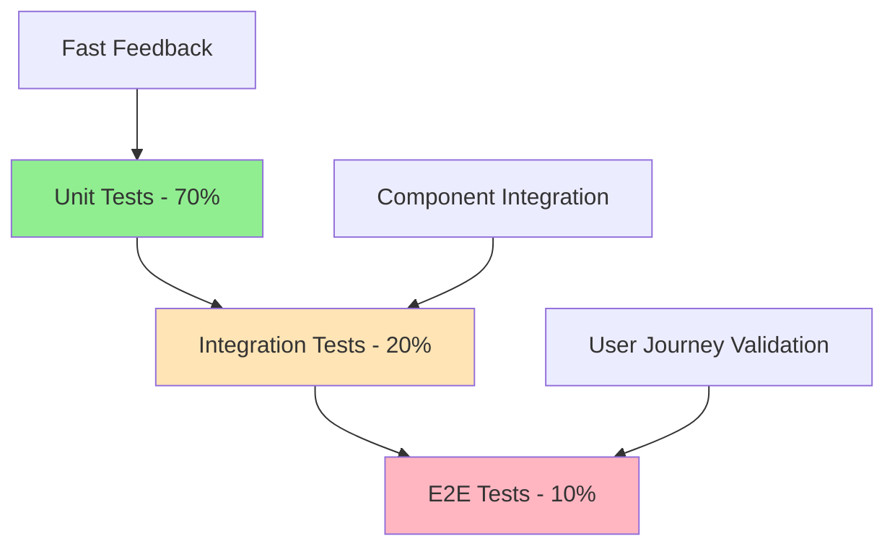

# Testing and Validation Procedures

**Date:** 2025-08-08  
**Status:** Production Ready  
**Version:** 2.0  
**Priority:** Critical - Quality Assurance

## Executive Summary

This document provides comprehensive testing and validation procedures for the updated melt operation system. It covers all testing levels from unit tests to end-to-end validation, ensuring the reliability, performance, and correctness of the atomic transaction system, pre-flight reconciliation, and enhanced error handling.

## Table of Contents

1. [Testing Strategy Overview](#testing-strategy-overview)
2. [Unit Testing Procedures](#unit-testing-procedures)
3. [Integration Testing](#integration-testing)
4. [End-to-End Testing](#end-to-end-testing)
5. [Performance Testing](#performance-testing)
6. [Security Testing](#security-testing)
7. [Compatibility Testing](#compatibility-testing)
8. [Load Testing](#load-testing)
9. [Chaos Engineering](#chaos-engineering)
10. [Test Data Management](#test-data-management)
11. [Continuous Integration](#continuous-integration)
12. [Production Validation](#production-validation)

---

## Testing Strategy Overview

### Testing Pyramid



### Test Coverage Goals

#### Coverage Targets
- **Unit Tests**: >95% code coverage
- **Integration Tests**: >90% API endpoint coverage
- **E2E Tests**: >95% critical user journey coverage
- **Performance Tests**: 100% critical path coverage

#### Quality Gates
- **All tests must pass** before deployment
- **Performance benchmarks** must be met
- **Security scans** must show no critical vulnerabilities
- **Backward compatibility** must be maintained

### Test Categories

#### 1. Functional Testing
- **Unit Tests**: Individual function and method testing
- **Integration Tests**: Component interaction testing
- **API Tests**: Endpoint behavior validation
- **Database Tests**: Data integrity and consistency

#### 2. Non-Functional Testing
- **Performance Tests**: Response time and throughput
- **Load Tests**: System behavior under load
- **Security Tests**: Vulnerability and penetration testing
- **Compatibility Tests**: Backward compatibility validation

#### 3. Specialized Testing
- **Chaos Engineering**: Failure scenario testing
- **Atomic Transaction Tests**: ACID compliance validation
- **Reconciliation Tests**: Proof state consistency
- **Error Handling Tests**: Error classification and recovery

---

## Unit Testing Procedures

### Test Structure and Organization

#### Test File Organization
```
tests/
├── unit/
│   ├── services/
│   │   ├── cashu.service.test.js
│   │   ├── walletRepository.service.test.js
│   │   ├── validation.service.test.js
│   │   └── monitoring.service.test.js
│   ├── controllers/
│   │   └── wallet.controller.test.js
│   ├── models/
│   │   ├── CashuToken.model.test.js
│   │   └── CashuWallet.model.test.js
│   └── utils/
│       ├── logger.test.js
│       └── validation.test.js
├── integration/
├── e2e/
└── performance/
```

### Critical Unit Tests

#### 1. Atomic Melt Transaction Tests
```javascript
// tests/unit/walletRepository.service.test.js
describe('executeAtomicMelt', () => {
  it('should execute atomic melt transaction successfully', async () => {
    // Setup: Create source tokens
    const sourceToken = await CashuToken.create({
      npub: testNpub,
      wallet_id: testWallet._id,
      mint_url: testMintUrl,
      transaction_id: 'tx_source_1',
      transaction_type: 'minted',
      status: 'unspent',
      proofs: [
        { id: 'proof1', amount: 1000, secret: 'secret1', C: 'commitment1' }
      ]
    });

    const keepProofs = [
      { id: 'keep1', amount: 200, secret: 'keep_secret1', C: 'keep_commitment1' }
    ];

    const meltChangeProofs = [
      { id: 'change1', amount: 100, secret: 'change_secret1', C: 'change_commitment1' }
    ];

    // Execute atomic melt
    const result = await walletRepositoryService.executeAtomicMelt(
      [sourceToken._id],
      keepProofs,
      meltChangeProofs,
      'tx_melt_123',
      {
        npub: testNpub,
        wallet_id: testWallet._id,
        mint_url: testMintUrl
      }
    );

    // Verify results
    expect(result.success).toBe(true);
    expect(result.source_tokens_spent).toBe(1);
    expect(result.keep_amount).toBe(200);
    expect(result.melt_change_amount).toBe(100);

    // Verify database state
    const updatedSourceToken = await CashuToken.findById(sourceToken._id);
    expect(updatedSourceToken.status).toBe('spent');
    expect(updatedSourceToken.spent_at).toBeDefined();

    // Verify change tokens created
    const changeTokens = await CashuToken.find({
      npub: testNpub,
      transaction_type: 'change'
    });
    expect(changeTokens).toHaveLength(2);

    // Verify no melted tokens created
    const meltedTokens = await CashuToken.find({
      npub: testNpub,
      transaction_type: 'melted'
    });
    expect(meltedTokens).toHaveLength(0);
  });

  it('should rollback on failure', async () => {
    const sourceToken = await CashuToken.create({
      npub: testNpub,
      wallet_id: testWallet._id,
      mint_url: testMintUrl,
      transaction_id: 'tx_source_1',
      transaction_type: 'minted',
      status: 'unspent',
      proofs: [{ id: 'proof1', amount: 1000, secret: 'secret1', C: 'commitment1' }]
    });

    // Force failure with invalid data
    const invalidKeepProofs = [
      { amount: 100, secret: 'keep_secret1', C: 'keep_commitment1' } // Missing 'id' field
    ];

    // Attempt atomic melt that should fail
    await expect(
      walletRepositoryService.executeAtomicMelt(
        [sourceToken._id],
        invalidKeepProofs,
        [],
        'tx_melt_fail',
        {
          npub: testNpub,
          wallet_id: testWallet._id,
          mint_url: testMintUrl
        }
      )
    ).rejects.toThrow();

    // Verify rollback: source token should remain unspent
    const unchangedToken = await CashuToken.findById(sourceToken._id);
    expect(unchangedToken.status).toBe('unspent');
    expect(unchangedToken.spent_at).toBeNull();

    // Verify no partial state changes
    const allTokens = await CashuToken.find({ npub: testNpub });
    expect(allTokens).toHaveLength(1);
    expect(allTokens[0]._id.toString()).toBe(sourceToken._id.toString());
  });
});
```

#### 2. Proof State Reconciliation Tests
```javascript
// tests/unit/proofStateReconciliation.test.js
describe('Proof State Reconciliation', () => {
  it('should detect HIGH severity discrepancies', async () => {
    // Mock mint response showing proof as spent
    const mockMintStates = [
      { state: 'SPENT', witness: null }
    ];

    // Mock wallet.checkProofsStates
    const mockWallet = {
      checkProofsStates: jest.fn().mockResolvedValue(mockMintStates)
    };

    // Create database token showing as unspent
    await CashuToken.create({
      npub: testNpub,
      wallet_id: testWallet._id,
      mint_url: testMintUrl,
      transaction_id: 'tx_test',
      transaction_type: 'minted',
      status: 'unspent',
      proofs: [
        { id: 'proof1', amount: 1000, secret: 'secret1', C: 'commitment1' }
      ]
    });

    const proofs = [
      { id: 'proof1', amount: 1000, secret: 'secret1', C: 'commitment1' }
    ];

    // Execute proof state check
    const result = await checkProofStatesWithMock(testNpub, proofs, mockWallet);

    // Verify HIGH severity discrepancy detected
    expect(result.consistent).toBe(false);
    expect(result.hasHighSeverity).toBe(true);
    expect(result.severityCounts.HIGH).toBe(1);
    expect(result.discrepancies).toHaveLength(1);
    expect(result.discrepancies[0].type).toBe('DB_UNSPENT_MINT_SPENT');
    expect(result.discrepancies[0].severity).toBe('HIGH');
  });

  it('should automatically correct MEDIUM severity discrepancies', async () => {
    // Create token with pending status
    const pendingToken = await CashuToken.create({
      npub: testNpub,
      wallet_id: testWallet._id,
      mint_url: testMintUrl,
      transaction_id: 'tx_pending',
      transaction_type: 'minted',
      status: 'pending',
      proofs: [
        { id: 'proof1', amount: 1000, secret: 'secret1', C: 'commitment1' }
      ]
    });

    const discrepancies = [
      {
        severity: 'MEDIUM',
        type: 'DB_PENDING_MINT_SPENT',
        token_id: pendingToken._id,
        proof_amount: 1000,
        action_required: 'UPDATE_STATUS'
      }
    ];

    // Execute reconciliation
    const result = await reconcileProofStates(testNpub, discrepancies);

    // Verify successful reconciliation
    expect(result.success).toBe(true);
    expect(result.blocked).toBe(false);
    expect(result.reconciliationSummary.resolved).toBe(1);

    // Verify token status updated
    const updatedToken = await CashuToken.findById(pendingToken._id);
    expect(updatedToken.status).toBe('spent');
  });
});
```

#### 3. Balance Calculation Tests
```javascript
// tests/unit/balanceCalculation.test.js
describe('Balance Calculation Accuracy', () => {
  it('should calculate accurate balance without double counting', async () => {
    // Create initial minted tokens
    await CashuToken.create({
      npub: testNpub,
      wallet_id: testWallet._id,
      mint_url: testMintUrl,
      transaction_id: 'tx_initial_1',
      transaction_type: 'minted',
      status: 'unspent',
      proofs: [{ id: 'proof1', amount: 1000, secret: 'secret1', C: 'commitment1' }]
    });

    await CashuToken.create({
      npub: testNpub,
      wallet_id: testWallet._id,
      mint_url: testMintUrl,
      transaction_id: 'tx_initial_2',
      transaction_type: 'minted',
      status: 'spent',
      proofs: [{ id: 'proof2', amount: 500, secret: 'secret2', C: 'commitment2' }]
    });

    // Create change tokens from melt operation
    await CashuToken.create({
      npub: testNpub,
      wallet_id: testWallet._id,
      mint_url: testMintUrl,
      transaction_id: 'tx_melt_123_keep',
      transaction_type: 'change',
      status: 'unspent',
      proofs: [{ id: 'keep1', amount: 200, secret: 'keep_secret1', C: 'keep_commitment1' }]
    });

    // Calculate balance
    const balance = await walletRepositoryService.calculateBalance(testNpub, testMintUrl);

    // Verify accurate calculation
    expect(balance.unspent_balance).toBe(1200); // 1000 + 200
    expect(balance.spent_balance).toBe(500);
    expect(balance.total_balance).toBe(1700); // No double counting
  });

  it('should prevent double counting from melted tokens', async () => {
    // Verify no melted tokens exist in new system
    const meltedTokens = await CashuToken.find({
      npub: testNpub,
      transaction_type: 'melted'
    });
    expect(meltedTokens).toHaveLength(0);

    // If any exist from legacy system, they should not affect balance
    // (This test ensures the new system doesn't create them)
  });
});
```

### Test Utilities and Helpers

#### Mock Factory
```javascript
// tests/utils/mockFactory.js
export class MockFactory {
  static createMockWallet(overrides = {}) {
    return {
      createMeltQuote: jest.fn().mockResolvedValue({
        quote: 'quote_123',
        amount: 1000,
        fee_reserve: 50,
        expiry: Date.now() + 3600000
      }),
      send: jest.fn().mockResolvedValue({
        send: [{ id: 'send1', amount: 1050, secret: 'send_secret1', C: 'send_c1' }],
        keep: [{ id: 'keep1', amount: 200, secret: 'keep_secret1', C: 'keep_c1' }]
      }),
      meltProofs: jest.fn().mockResolvedValue({
        state: 'PAID',
        change: [{ id: 'change1', amount: 50, secret: 'change_secret1', C: 'change_c1' }]
      }),
      checkProofsStates: jest.fn().mockResolvedValue([
        { state: 'UNSPENT', witness: null }
      ]),
      ...overrides
    };
  }

  static createTestToken(overrides = {}) {
    return {
      npub: 'npub1test123456789abcdefghijklmnopqrstuvwxyz0123456789abcdef',
      wallet_id: new mongoose.Types.ObjectId(),
      mint_url: 'https://mint.example.com',
      transaction_id: 'tx_test_123',
      transaction_type: 'minted',
      status: 'unspent',
      proofs: [
        { id: 'proof1', amount: 1000, secret: 'secret1', C: 'commitment1' }
      ],
      metadata: { source: 'test' },
      ...overrides
    };
  }
}
```

#### Test Database Setup
```javascript
// tests/utils/testDatabase.js
export class TestDatabase {
  static async setup() {
    // Connect to test database
    await mongoose.connect(process.env.TEST_MONGODB_URI);
    
    // Clear all collections
    await this.clearDatabase();
  }

  static async teardown() {
    await this.clearDatabase();
    await mongoose.connection.close();
  }

  static async clearDatabase() {
    const collections = await mongoose.connection.db.collections();
    
    for (const collection of collections) {
      await collection.deleteMany({});
    }
  }

  static async createTestWallet(npub = 'test-npub') {
    return await CashuWallet.create({
      npub,
      mint_url: 'https://mint.example.com',
      p2pk_pubkey: '0123456789abcdef0123456789abcdef0123456789abcdef0123456789abcdef',
      p2pk_privkey: 'fedcba9876543210fedcba9876543210fedcba9876543210fedcba9876543210',
      wallet_config: { unit: 'sat', created_via: 'test' }
    });
  }
}
```

---

## Integration Testing

### Service Integration Tests

#### 1. Cashu Service Integration
```javascript
// tests/integration/cashuService.integration.test.js
describe('Cashu Service Integration', () => {
  it('should integrate with wallet repository for atomic operations', async () => {
    // Setup: Create wallet and tokens
    const wallet = await TestDatabase.createTestWallet();
    const sourceToken = await CashuToken.create(
      MockFactory.createTestToken({
        npub: wallet.npub,
        wallet_id: wallet._id
      })
    );

    // Mock external dependencies
    const mockWallet = MockFactory.createMockWallet();
    jest.spyOn(cashuService, 'initializeWallet').mockResolvedValue({
      wallet: mockWallet,
      walletDoc: wallet,
      mint: {}
    });

    // Execute melt operation
    const result = await cashuService.meltTokens(
      wallet.npub,
      'lnbc1000n1pjqxqzjsp5...'
    );

    // Verify integration
    expect(result.transactionId).toBeDefined();
    expect(result.paymentResult).toBe('PAID');
    expect(result.atomicResult).toBeDefined();
    expect(result.atomicResult.success).toBe(true);

    // Verify database state
    const updatedToken = await CashuToken.findById(sourceToken._id);
    expect(updatedToken.status).toBe('spent');
  });

  it('should handle pre-flight reconciliation integration', async () => {
    const wallet = await TestDatabase.createTestWallet();
    
    // Create token that will show discrepancy
    await CashuToken.create(
      MockFactory.createTestToken({
        npub: wallet.npub,
        wallet_id: wallet._id,
        status: 'unspent'
      })
    );

    // Mock mint showing proof as spent
    const mockWallet = MockFactory.createMockWallet({
      checkProofsStates: jest.fn().mockResolvedValue([
        { state: 'SPENT', witness: null }
      ])
    });

    jest.spyOn(cashuService, 'initializeWallet').mockResolvedValue({
      wallet: mockWallet,
      walletDoc: wallet,
      mint: {}
    });

    // Execute melt operation - should be blocked
    await expect(
      cashuService.meltTokens(wallet.npub, 'lnbc1000n1pjqxqzjsp5...')
    ).rejects.toThrow('Cannot proceed with Lightning payment');
  });
});
```

#### 2. Database Transaction Integration
```javascript
// tests/integration/databaseTransactions.integration.test.js
describe('Database Transaction Integration', () => {
  it('should maintain ACID properties across operations', async () => {
    const wallet = await TestDatabase.createTestWallet();
    
    // Create multiple source tokens
    const tokens = await Promise.all([
      CashuToken.create(MockFactory.createTestToken({
        npub: wallet.npub,
        wallet_id: wallet._id,
        transaction_id: 'tx_source_1'
      })),
      CashuToken.create(MockFactory.createTestToken({
        npub: wallet.npub,
        wallet_id: wallet._id,
        transaction_id: 'tx_source_2'
      }))
    ]);

    // Execute concurrent atomic operations
    const operations = tokens.map((token, index) =>
      walletRepositoryService.executeAtomicMelt(
        [token._id],
        [{ id: `keep${index}`, amount: 100, secret: `keep${index}`, C: `keepc${index}` }],
        [{ id: `change${index}`, amount: 50, secret: `change${index}`, C: `changec${index}` }],
        `tx_melt_${index}`,
        {
          npub: wallet.npub,
          wallet_id: wallet._id,
          mint_url: 'https://mint.example.com'
        }
      )
    );

    // All operations should succeed
    const results = await Promise.all(operations);
    results.forEach(result => {
      expect(result.success).toBe(true);
    });

    // Verify final state consistency
    const allTokens = await CashuToken.find({ npub: wallet.npub });
    const spentTokens = allTokens.filter(t => t.status === 'spent');
    const changeTokens = allTokens.filter(t => t.transaction_type === 'change');

    expect(spentTokens).toHaveLength(2);
    expect(changeTokens).toHaveLength(4); // 2 operations × 2 change types
  });
});
```

### API Integration Tests

#### 1. Melt Endpoint Integration
```javascript
// tests/integration/meltEndpoint.integration.test.js
describe('Melt Endpoint Integration', () => {
  it('should handle complete melt operation flow', async () => {
    // Setup test data
    const wallet = await TestDatabase.createTestWallet();
    await CashuToken.create(
      MockFactory.createTestToken({
        npub: wallet.npub,
        wallet_id: wallet._id,
        proofs: [
          { id: 'proof1', amount: 1200, secret: 'secret1', C: 'commitment1' }
        ]
      })
    );

    // Mock external services
    jest.spyOn(cashuService, 'meltTokens').mockResolvedValue({
      transactionId: 'tx_melt_123',
      paymentResult: 'PAID',
      paidAmount: 1000,
      feesPaid: 50,
      changeAmount: 150,
      quoteId: 'quote_123',
      atomicResult: {
        success: true,
        source_tokens_spent: 1,
        operations: []
      }
    });

    // Execute API request
    const response = await request(app)
      .post(`/api/wallet/${wallet.npub}/melt`)
      .send({ invoice: 'lnbc1000n1pjqxqzjsp5...' })
      .expect(200);

    // Verify response structure
    expect(response.body.success).toBe(true);
    expect(response.body.transactionId).toBe('tx_melt_123');
    expect(response.body.atomicResult).toBeDefined();
  });

  it('should handle error responses correctly', async () => {
    const wallet = await TestDatabase.createTestWallet();

    // Mock service error
    jest.spyOn(cashuService, 'meltTokens').mockRejectedValue(
      new Error('Insufficient balance. Required: 1000, Available: 500')
    );

    const response = await request(app)
      .post(`/api/wallet/${wallet.npub}/melt`)
      .send({ invoice: 'lnbc1000n1pjqxqzjsp5...' })
      .expect(500);

    expect(response.body.error).toBe('Failed to melt tokens');
    expect(response.body.message).toContain('Insufficient balance');
  });
});
```

---

## End-to-End Testing

### Complete User Journey Tests

#### 1. Successful Melt Operation E2E
```javascript
// tests/e2e/meltOperationFlow.test.js
describe('Complete Melt Operation Flow E2E', () => {
  it('should complete full melt operation with atomic persistence', async () => {
    // Setup: Create unspent tokens for melting
    const sourceToken1 = await CashuToken.create({
      npub: testNpub,
      wallet_id: testWallet._id,
      mint_url: testMintUrl,
      transaction_id: 'tx_source_1',
      transaction_type: 'minted',
      status: 'unspent',
      proofs: [
        { id: 'proof1', amount: 500, secret: 'secret1', C: 'commitment1' },
        { id: 'proof2', amount: 300, secret: 'secret2', C: 'commitment2' }
      ],
      metadata: { source: 'lightning' }
    });

    // Mock successful pre-flight reconciliation
    performPreFlightReconciliation.mockResolvedValue({
      success: true,
      operationCleared: true,
      discrepanciesFound: false
    });

    // Mock successful melt operation
    meltTokens.mockResolvedValue({
      transactionId: 'tx_melt_123',
      paymentResult: 'PAID',
      paidAmount: 1000,
      feesPaid: 50,
      changeAmount: 150,
      atomicResult: {
        success: true,
        source_tokens_spent: 2,
        operations: [
          {
            type: 'keep_change',
            token_id: 'keep_token_456',
            amount: 100,
            proof_count: 1
          },
          {
            type: 'melt_change',
            token_id: 'melt_change_token_789',
            amount: 50,
            proof_count: 1
          }
        ]
      }
    });

    // Execute melt operation
    const response = await request(app)
      .post(`/api/wallet/${testNpub}/melt`)
      .send({ invoice: testInvoice })
      .expect(200);

    // Verify response structure
    expect(response.body.success).toBe(true);
    expect(response.body.transactionId).toBe('tx_melt_123');
    expect(response.body.atomicResult.success).toBe(true);

    // Verify pre-flight reconciliation was called
    expect(performPreFlightReconciliation).toHaveBeenCalledWith(
      testNpub,
      expect.arrayContaining([
        expect.objectContaining({ secret: 'secret1' }),
        expect.objectContaining({ secret: 'secret2' })
      ])
    );

    // Verify monitoring metrics
    const metrics = MonitoringService.getMeltingMetrics();
    expect(metrics.melt.attempts).toBe(1);
    expect(metrics.melt.successes).toBe(1);
  });
});
```

#### 2. Error Handling E2E Tests
```javascript
describe('Error Handling E2E', () => {
  it('should block operation on HIGH severity discrepancies', async () => {
    // Setup: Create unspent tokens
    await CashuToken.create({
      npub: testNpub,
      wallet_id: testWallet._id,
      mint_url: testMintUrl,
      transaction_id: 'tx_source_1',
      transaction_type: 'minted',
      status: 'unspent',
      proofs: [
        { id: 'proof1', amount: 1000, secret: 'secret1', C: 'commitment1' }
      ]
    });

    // Mock pre-flight reconciliation blocking
    const highSeverityError = new Error(
      'Melt operation blocked due to HIGH severity proof state discrepancies.'
    );
    highSeverityError.code = 'HIGH_SEVERITY_DISCREPANCIES';
    performPreFlightReconciliation.mockRejectedValue(highSeverityError);

    const response = await request(app)
      .post(`/api/wallet/${testNpub}/melt`)
      .send({ invoice: testInvoice })
      .expect(400);

    expect(response.body.error).toBe('Proof state validation failed');
    expect(response.body.code).toBe('PROOF_STATE_INCONSISTENCY');
    expect(response.body.severity).toBe('CRITICAL');

    // Verify melt operation was not called
    expect(meltTokens).not.toHaveBeenCalled();
  });
});
```

### Browser-Based E2E Tests

#### Playwright Test Configuration
```javascript
// tests/e2e/playwright.config.js
import { defineConfig } from '@playwright/test';

export default defineConfig({
  testDir: './tests/e2e/browser',
  timeout: 30000,
  retries: 2,
  use: {
    baseURL: 'http://localhost:3000',
    trace: 'on-first-retry',
    screenshot: 'only-on-failure'
  },
  projects: [
    {
      name: 'chromium',
      use: { ...devices['Desktop Chrome'] }
    },
    {
      name: 'firefox',
      use: { ...devices['Desktop Firefox'] }
    }
  ]
});
```

#### Browser E2E Test Example
```javascript
// tests/e2e/browser/meltOperation.spec.js
import { test, expect } from '@playwright/test';

test.describe('Melt Operation Browser Tests', () => {
  test('should complete melt operation through UI', async ({ page }) => {
    // Navigate to wallet page
    await page.goto('/wallet/npub1test...');
    
    // Wait for wallet to load
    await expect(page.locator('[data-testid="wallet-balance"]')).toBeVisible();
    
    // Click melt button
    await page.click('[data-testid="melt-button"]');
    
    // Enter Lightning invoice
    await page.fill('[data-testid="invoice-input"]', 'lnbc1000n1pjqxqzjsp5...');
    
    // Submit melt operation
    await page.click('[data-testid="submit-melt"]');
    
    // Wait for success message
    await expect(page.locator('[data-testid="success-message"]')).toBeVisible();
    
    // Verify transaction appears in history
    await expect(page.locator('[data-testid="transaction-history"]')).toContainText('tx_melt_');
  });

  test('should handle error states gracefully', async ({ page }) => {
    await page.goto('/wallet/npub1test...');
    
    // Mock API error response
    await page.route('/api/wallet/*/melt', route => {
      route.fulfill({
        status: 400,
        contentType: 'application/json',
        body: JSON.stringify({
          error: 'Insufficient balance',
          message: 'Insufficient balance. Required: 1000, Available: 500',
          code: 'INSUFFICIENT_BALANCE'
        })
      });
    });
    
    await page.click('[data-testid="melt-button"]');
    await page.fill('[data-testid="invoice-input"]', 'lnbc1000n1pjqxqzjsp5...');
    await page.click('[data-testid="submit-melt"]');
    
    // Verify error message displayed
    await expect(page.locator('[data-testid="error-message"]')).toContainText('Insufficient balance');
  });
});
```

---

## Performance Testing

### Performance Test Strategy

#### 1. Response Time Testing
```javascript
// tests/performance/responseTime.test.js
describe('Response Time Performance', () => {
  it('should complete melt operation within 3 seconds', async () => {
();
    
    // Setup test data
    const wallet = await TestDatabase.createTestWallet();
    await CashuToken.create(
      MockFactory.createTestToken({
        npub: wallet.npub,
        wallet_id: wallet._id,
        proofs: [
          { id: 'proof1', amount: 1000, secret: 'secret1', C: 'commitment1' }
        ]
      })
    );

    // Execute melt operation
    const result = await cashuService.meltTokens(
      wallet.npub,
      'lnbc1000n1pjqxqzjsp5...'
    );

    const endTime = Date.now();
    const responseTime = endTime - startTime;

    // Verify performance requirement
    expect(responseTime).toBeLessThan(3000);
    expect(result.transactionId).toBeDefined();
  });

  it('should handle concurrent operations efficiently', async () => {
    const wallet = await TestDatabase.createTestWallet();
    
    // Create multiple tokens for concurrent operations
    const tokens = await Promise.all(
      Array.from({ length: 10 }, (_, i) =>
        CashuToken.create(
          MockFactory.createTestToken({
            npub: wallet.npub,
            wallet_id: wallet._id,
            transaction_id: `tx_concurrent_${i}`
          })
        )
      )
    );

    const startTime = Date.now();

    // Execute concurrent melt operations
    const operations = tokens.map((token, index) =>
      cashuService.meltTokens(
        wallet.npub,
        `lnbc100n1pjqxqzjsp5...${index}`
      )
    );

    const results = await Promise.all(operations);
    const endTime = Date.now();
    const totalTime = endTime - startTime;

    // Verify all operations succeeded
    results.forEach(result => {
      expect(result.transactionId).toBeDefined();
      expect(result.paymentResult).toBe('PAID');
    });

    // Verify reasonable performance under load
    expect(totalTime).toBeLessThan(10000); // 10 seconds for 10 operations
  });
});
```

#### 2. Throughput Testing
```javascript
// tests/performance/throughput.test.js
describe('Throughput Performance', () => {
  it('should handle minimum required transactions per second', async () => {
    const wallet = await TestDatabase.createTestWallet();
    const targetTPS = 10; // 10 transactions per second
    const testDuration = 5000; // 5 seconds
    const expectedTransactions = Math.floor((testDuration / 1000) * targetTPS);

    let completedTransactions = 0;
    const startTime = Date.now();

    // Create continuous stream of transactions
    const transactionPromises = [];
    
    while (Date.now() - startTime < testDuration) {
      const promise = cashuService.meltTokens(
        wallet.npub,
        `lnbc100n1pjqxqzjsp5...${completedTransactions}`
      ).then(() => {
        completedTransactions++;
      }).catch(() => {
        // Count failed transactions for throughput calculation
        completedTransactions++;
      });
      
      transactionPromises.push(promise);
      
      // Small delay to prevent overwhelming the system
      await new Promise(resolve => setTimeout(resolve, 100));
    }

    await Promise.allSettled(transactionPromises);

    const actualTPS = completedTransactions / (testDuration / 1000);
    expect(actualTPS).toBeGreaterThanOrEqual(targetTPS);
  });
});
```

#### 3. Memory Usage Testing
```javascript
// tests/performance/memory.test.js
describe('Memory Usage Performance', () => {
  it('should not have memory leaks during extended operations', async () => {
    const wallet = await TestDatabase.createTestWallet();
    const initialMemory = process.memoryUsage().heapUsed;

    // Perform many operations
    for (let i = 0; i < 100; i++) {
      await CashuToken.create(
        MockFactory.createTestToken({
          npub: wallet.npub,
          wallet_id: wallet._id,
          transaction_id: `tx_memory_test_${i}`
        })
      );

      await cashuService.meltTokens(
        wallet.npub,
        `lnbc100n1pjqxqzjsp5...${i}`
      );

      // Force garbage collection periodically
      if (i % 10 === 0 && global.gc) {
        global.gc();
      }
    }

    const finalMemory = process.memoryUsage().heapUsed;
    const memoryIncrease = finalMemory - initialMemory;
    const memoryIncreasePercent = (memoryIncrease / initialMemory) * 100;

    // Memory increase should be reasonable (less than 50%)
    expect(memoryIncreasePercent).toBeLessThan(50);
  });
});
```

---

## Security Testing

### Security Test Framework

#### 1. Input Validation Tests
```javascript
// tests/security/inputValidation.test.js
describe('Input Validation Security', () => {
  it('should reject malicious invoice inputs', async () => {
    const wallet = await TestDatabase.createTestWallet();
    
    const maliciousInputs = [
      'javascript:alert("xss")',
      '<script>alert("xss")</script>',
      '../../etc/passwd',
      'lnbc1000n1pjqxqzjsp5...\'; DROP TABLE CashuToken; --',
      'lnbc' + 'A'.repeat(10000), // Extremely long input
      null,
      undefined,
      { malicious: 'object' }
    ];

    for (const maliciousInput of maliciousInputs) {
      const response = await request(app)
        .post(`/api/wallet/${wallet.npub}/melt`)
        .send({ invoice: maliciousInput })
        .expect(400);

      expect(response.body.error).toContain('Invalid invoice format');
    }
  });

  it('should validate npub format strictly', async () => {
    const maliciousNpubs = [
      '../../../etc/passwd',
      'npub1' + 'x'.repeat(100),
      'not-an-npub',
      '<script>alert("xss")</script>',
      null,
      undefined
    ];

    for (const maliciousNpub of maliciousNpubs) {
      const response = await request(app)
        .post(`/api/wallet/${maliciousNpub}/melt`)
        .send({ invoice: 'lnbc1000n1pjqxqzjsp5...' })
        .expect(400);

      expect(response.body.error).toContain('Invalid npub format');
    }
  });
});
```

#### 2. Authentication and Authorization Tests
```javascript
// tests/security/authentication.test.js
describe('Authentication Security', () => {
  it('should require valid authentication for sensitive operations', async () => {
    // Test without authentication
    const response = await request(app)
      .post('/api/wallet/npub1test.../melt')
      .send({ invoice: 'lnbc1000n1pjqxqzjsp5...' })
      .expect(401);

    expect(response.body.error).toBe('Authentication required');
  });

  it('should prevent access to other users wallets', async () => {
    const wallet1 = await TestDatabase.createTestWallet('npub1user1...');
    const wallet2 = await TestDatabase.createTestWallet('npub1user2...');

    // Try to access wallet1 with wallet2 credentials
    const response = await request(app)
      .post(`/api/wallet/${wallet1.npub}/melt`)
      .set('Authorization', `Bearer ${generateToken(wallet2.npub)}`)
      .send({ invoice: 'lnbc1000n1pjqxqzjsp5...' })
      .expect(403);

    expect(response.body.error).toBe('Access denied');
  });
});
```

#### 3. Data Protection Tests
```javascript
// tests/security/dataProtection.test.js
describe('Data Protection Security', () => {
  it('should not expose sensitive data in error messages', async () => {
    const wallet = await TestDatabase.createTestWallet();
    
    // Create token with sensitive data
    await CashuToken.create({
      npub: wallet.npub,
      wallet_id: wallet._id,
      mint_url: 'https://mint.example.com',
      transaction_id: 'tx_sensitive',
      transaction_type: 'minted',
      status: 'unspent',
      proofs: [
        { 
          id: 'proof1', 
          amount: 1000, 
          secret: 'very-secret-data-should-not-leak', 
          C: 'commitment1' 
        }
      ]
    });

    // Force an error condition
    jest.spyOn(cashuService, 'meltTokens').mockRejectedValue(
      new Error('Database connection failed')
    );

    const response = await request(app)
      .post(`/api/wallet/${wallet.npub}/melt`)
      .send({ invoice: 'lnbc1000n1pjqxqzjsp5...' })
      .expect(500);

    // Verify sensitive data is not exposed
    expect(response.body.message).not.toContain('very-secret-data-should-not-leak');
    expect(response.body.message).not.toContain('commitment1');
    expect(response.body.message).not.toContain(wallet._id.toString());
  });

  it('should encrypt sensitive data at rest', async () => {
    const wallet = await TestDatabase.createTestWallet();
    
    const token = await CashuToken.create({
      npub: wallet.npub,
      wallet_id: wallet._id,
      mint_url: 'https://mint.example.com',
      transaction_id: 'tx_encryption_test',
      transaction_type: 'minted',
      status: 'unspent',
      proofs: [
        { 
          id: 'proof1', 
          amount: 1000, 
          secret: 'secret-to-encrypt', 
          C: 'commitment1' 
        }
      ]
    });

    // Verify that sensitive fields are encrypted in database
    const rawDocument = await mongoose.connection.db
      .collection('cashutokens')
      .findOne({ _id: token._id });

    // Check if secret is encrypted (should not be plain text)
    expect(rawDocument.proofs[0].secret).not.toBe('secret-to-encrypt');
    expect(rawDocument.proofs[0].secret).toMatch(/^[a-f0-9]+$/); // Encrypted hex
  });
});
```

---

## Compatibility Testing

### Backward Compatibility Tests

#### 1. Legacy Data Compatibility
```javascript
// tests/compatibility/legacyData.test.js
describe('Legacy Data Compatibility', () => {
  it('should handle legacy melted tokens correctly', async () => {
    const wallet = await TestDatabase.createTestWallet();
    
    // Create legacy melted token (should not affect balance)
    await CashuToken.create({
      npub: wallet.npub,
      wallet_id: wallet._id,
      mint_url: 'https://mint.example.com',
      transaction_id: 'tx_legacy_melted',
      transaction_type: 'melted', // Legacy type
      status: 'spent',
      proofs: [
        { id: 'legacy1', amount: 500, secret: 'legacy_secret', C: 'legacy_c' }
      ]
    });

    // Create current unspent token
    await CashuToken.create({
      npub: wallet.npub,
      wallet_id: wallet._id,
      mint_url: 'https://mint.example.com',
      transaction_id: 'tx_current',
      transaction_type: 'minted',
      status: 'unspent',
      proofs: [
        { id: 'current1', amount: 1000, secret: 'current_secret', C: 'current_c' }
      ]
    });

    // Calculate balance - should not double count legacy melted tokens
    const balance = await walletRepositoryService.calculateBalance(
      wallet.npub, 
      'https://mint.example.com'
    );

    expect(balance.unspent_balance).toBe(1000);
    expect(balance.total_balance).toBe(1500); // 1000 unspent + 500 legacy spent
  });

  it('should migrate legacy data structures', async () => {
    const wallet = await TestDatabase.createTestWallet();
    
    // Create token with legacy structure
    await CashuToken.create({
      npub: wallet.npub,
      wallet_id: wallet._id,
      mint_url: 'https://mint.example.com',
      transaction_id: 'tx_legacy_structure',
      transaction_type: 'minted',
      status: 'unspent',
      proofs: [
        { 
          id: 'legacy1', 
          amount: 1000, 
          secret: 'legacy_secret', 
          C: 'legacy_c'
          // Missing new fields that should be added during migration
        }
      ],
      // Missing new metadata fields
    });

    // Run migration
    await walletRepositoryService.migrateLegacyTokens(wallet.npub);

    // Verify migration completed
    const migratedToken = await CashuToken.findOne({
      npub: wallet.npub,
      transaction_id: 'tx_legacy_structure'
    });

    expect(migratedToken.metadata).toBeDefined();
    expect(migratedToken.metadata.migrated).toBe(true);
    expect(migratedToken.metadata.migration_date).toBeDefined();
  });
});
```

#### 2. API Version Compatibility
```javascript
// tests/compatibility/apiVersions.test.js
describe('API Version Compatibility', () => {
  it('should support v1 API format', async () => {
    const wallet = await TestDatabase.createTestWallet();
    
    // Test v1 API endpoint
    const response = await request(app)
      .post(`/api/v1/wallet/${wallet.npub}/melt`)
      .send({ 
        invoice: 'lnbc1000n1pjqxqzjsp5...',
        // v1 format parameters
      })
      .expect(200);

    // Verify v1 response format
    expect(response.body).toHaveProperty('success');
    expect(response.body).toHaveProperty('transaction_id');
    expect(response.body).not.toHaveProperty('atomicResult'); // v2 field
  });

  it('should support v2 API format with enhanced features', async () => {
    const wallet = await TestDatabase.createTestWallet();
    
    // Test v2 API endpoint
    const response = await request(app)
      .post(`/api/v2/wallet/${wallet.npub}/melt`)
      .send({ 
        invoice: 'lnbc1000n1pjqxqzjsp5...',
        options: {
          enable_reconciliation: true,
          atomic_operations: true
        }
      })
      .expect(200);

    // Verify v2 response format
    expect(response.body).toHaveProperty('success');
    expect(response.body).toHaveProperty('transactionId');
    expect(response.body).toHaveProperty('atomicResult'); // v2 enhancement
    expect(response.body).toHaveProperty('reconciliationResult'); // v2 enhancement
  });
});
```

---

## Load Testing

### Load Test Configuration

#### 1. Stress Testing
```javascript
// tests/load/stressTest.test.js
describe('System Stress Testing', () => {
  it('should handle peak load conditions', async () => {
    const concurrentUsers = 50;
    const operationsPerUser = 10;
    const totalOperations = concurrentUsers * operationsPerUser;

    // Create test wallets
    const wallets = await Promise.all(
      Array.from({ length: concurrentUsers }, (_, i) =>
        TestDatabase.createTestWallet(`npub1user${i}...`)
      )
    );

    // Create tokens for each wallet
    await Promise.all(
      wallets.map(wallet =>
        Promise.all(
          Array.from({ length: operationsPerUser }, (_, i) =>
            CashuToken.create(
              MockFactory.createTestToken({
                npub: wallet.npub,
                wallet_id: wallet._id,
                transaction_id: `tx_stress_${wallet.npub}_${i}`
              })
            )
          )
        )
      )
    );

    const startTime = Date.now();
    let successfulOperations = 0;
    let failedOperations = 0;

    // Execute concurrent operations
    const operations = wallets.flatMap(wallet =>
      Array.from({ length: operationsPerUser }, (_, i) =>
        cashuService.meltTokens(
          wallet.npub,
          `lnbc100n1pjqxqzjsp5...${i}`
        ).then(() => {
          successfulOperations++;
        }).catch(() => {
          failedOperations++;
        })
      )
    );

    await Promise.allSettled(operations);
    const endTime = Date.now();
    const totalTime = endTime - startTime;

    // Verify system performance under stress
    const successRate = (successfulOperations / totalOperations) * 100;
    expect(successRate).toBeGreaterThan(95); // 95% success rate minimum
    expect(totalTime).toBeLessThan(60000); // Complete within 60 seconds
  });
});
```

#### 2. Endurance Testing
```javascript
// tests/load/enduranceTest.test.js
describe('System Endurance Testing', () => {
  it('should maintain performance over extended periods', async () => {
    const testDuration = 30 * 60 * 1000; // 30 minutes
    const operationInterval = 1000; // 1 operation per second
    const wallet = await TestDatabase.createTestWallet();

    let operationCount = 0;
    let errorCount = 0;
    const startTime = Date.now();
    const performanceMetrics = [];

    const enduranceTest = setInterval(async () => {
      const operationStart = Date.now();
      
      try {
        await cashuService.meltTokens(
          wallet.npub,
          `lnbc100n1pjqxqzjsp5...${operationCount}`
        );
        
        const operationTime = Date.now() - operationStart;
        performanceMetrics.push(operationTime);
        operationCount++;
      } catch (error) {
        errorCount++;
      }

      // Stop test after duration
      if (Date.now() - startTime >= testDuration) {
        clearInterval(enduranceTest);
      }
    }, operationInterval);

    // Wait for test completion
    await new Promise(resolve => {
      const checkCompletion = setInterval(() => {
        if (Date.now() - startTime >= testDuration) {
          clearInterval(checkCompletion);
          resolve();
        }
      }, 1000);
    });

    // Analyze performance degradation
    const firstQuarter = performanceMetrics.slice(0, Math.floor(performanceMetrics.length / 4));
    const lastQuarter = performanceMetrics.slice(-Math.floor(performanceMetrics.length / 4));
    
    const avgFirstQuarter = firstQuarter.reduce((a, b) => a + b, 0) / firstQuarter.length;
    const avgLastQuarter = lastQuarter.reduce((a, b) => a + b, 0) / lastQuarter.length;
    
    const performanceDegradation = ((avgLastQuarter - avgFirstQuarter) / avgFirstQuarter) * 100;

    // Verify system stability
    const errorRate = (errorCount / operationCount) * 100;
    expect(errorRate).toBeLessThan(5); // Less than 5% error rate
    expect(performanceDegradation).toBeLessThan(20); // Less than 20% degradation
  });
});
```

---

## Chaos Engineering

### Chaos Testing Framework

#### 1. Network Failure Simulation
```javascript
// tests/chaos/networkFailures.test.js
describe('Network Failure Chaos Testing', () => {
  it('should handle mint connectivity failures gracefully', async () => {
    const wallet = await TestDatabase.createTestWallet();
    
    // Create tokens for testing
    await CashuToken.create(
      MockFactory.createTestToken({
        npub: wallet.npub,
        wallet_id: wallet._id
      })
    );

    // Simulate network failure
    jest.spyOn(cashuService, 'initializeWallet').mockRejectedValue(
      new Error('ECONNREFUSED: Connection refused')
    );

    // Attempt melt operation during network failure
    await expect(
      cashuService.meltTokens(wallet.npub, 'lnbc1000n1pjqxqzjsp5...')
    ).rejects.toThrow('Mint connectivity failed');

    // Verify system state remains consistent
    const tokens = await CashuToken.find({ npub: wallet.npub });
    expect(tokens[0].status).toBe('unspent'); // No partial state changes
  });

  it('should recover from intermittent network issues', async () => {
    const wallet = await TestDatabase.createTestWallet();
    let callCount = 0;

    // Simulate intermittent failures
    jest.spyOn(cashuService, 'initializeWallet').mockImplementation(() => {
      callCount++;
      if (callCount <= 2) {
        throw new Error('Network timeout');
      }
      return Promise.resolve({
        wallet: MockFactory.createMockWallet(),
        walletDoc: wallet,
        mint: {}
      });
    });

    // Should succeed after retries
    const result = await cashuService.meltTokens(
      wallet.npub, 
      'lnbc1000n1pjqxqzjsp5...'
    );

    expect(result.transactionId).toBeDefined();
    expect(callCount).toBe(3); // Verify retry logic
  });
});
```

#### 2. Database Failure Simulation
```javascript
// tests/chaos/databaseFailures.test.js
describe('Database Failure Chaos Testing', () => {
  it('should handle database connection failures', async () => {
    const wallet = await TestDatabase.createTestWallet();
    
    // Simulate database connection failure during transaction
    jest.spyOn(mongoose.connection, 'startSession').mockRejectedValue(
      new Error('MongoNetworkError: Connection failed')
    );

    await expect(
      walletRepositoryService.executeAtomicMelt(
        ['token_id_123'],
        [{ id: 'keep1', amount: 100, secret: 'keep_secret', C: 'keep_c' }],
        [],
        'tx_db_fail',
        {
          npub: wallet.npub,
          wallet_id: wallet._id,
          mint_url: 'https://mint.example.com'
        }
      )
    ).rejects.toThrow('Database transaction failed');
  });

  it('should handle partial database failures with rollback', async () => {
    const wallet = await TestDatabase.createTestWallet();
    const sourceToken = await CashuToken.create(
      MockFactory.createTestToken({
        npub: wallet.npub,
        wallet_id: wallet._id
      })
    );

    // Simulate failure after partial operations
    let operationCount = 0;
    jest.spyOn(CashuToken.prototype, 'save').mockImplementation(function() {
      operationCount++;
      if (operationCount === 2) {
        throw new Error('Database write failed');
      }
      return Promise.resolve(this);
    });

    await expect(
      walletRepositoryService.executeAtomicMelt(
        [sourceToken._id],
        [{ id: 'keep1', amount: 100, secret: 'keep_secret', C: 'keep_c' }],
        [{ id: 'change1', amount: 50, secret: 'change_secret', C: 'change_c' }],
        'tx_partial_fail',
        {
          npub: wallet.npub,
          wallet_id: wallet._id,
          mint_url: 'https://mint.example.com'
        }
      )
    ).rejects.toThrow();

    // Verify rollback - original token should be unchanged
    const unchangedToken = await CashuToken.findById(sourceToken._id);
    expect(unchangedToken.status).toBe('unspent');
  });
});
```

---

## Test Data Management

### Test Data Strategy

#### 1. Test Data Factory
```javascript
// tests/utils/testDataFactory.js
export class TestDataFactory {
  static async createCompleteTestScenario(npub) {
    const wallet = await TestDatabase.createTestWallet(npub);
    
    // Create various token types
    const tokens = await Promise.all([
      // Unspent minted tokens
      CashuToken.create({
        npub,
        wallet_id: wallet._id,
        mint_url: 'https://mint.example.com',
        transaction_id: 'tx_minted_1',
        transaction_type: 'minted',
        status: 'unspent',
        proofs: [
          { id: 'mint1', amount: 1000, secret: 'mint_secret1', C: 'mint_c1' }
        ]
      }),
      
      // Spent minted tokens
      CashuToken.create({
        npub,
        wallet_id: wallet._id,
        mint_url: 'https://mint.example.com',
        transaction_id: 'tx_minted_2',
        transaction_type: 'minted',
        status: 'spent',
        proofs: [
          { id: 'mint2', amount: 500, secret: 'mint_secret2', C: 'mint_c2' }
        ]
      }),
      
      // Change tokens from previous operations
      CashuToken.create({
        npub,
        wallet_id: wallet._id,
        mint_url: 'https://mint.example.com',
        transaction_id: 'tx_change_1',
        transaction_type: 'change',
        status: 'unspent',
        proofs: [
          { id: 'change1', amount: 200, secret: 'change_secret1', C: 'change_c1' }
        ]
      })
    ]);

    return { wallet, tokens };
  }

  static async createStressTestData(userCount = 10, tokensPerUser = 5) {
    const scenarios = [];
    
    for (let i = 0; i < userCount; i++) {
      const npub = `npub1stress${i.toString().padStart(3, '0')}...`;
      const scenario = await this.createCompleteTestScenario(npub);
      
      // Add additional tokens for stress testing
      const additionalTokens = await Promise.all(
        Array.from({ length: tokensPerUser - 3 }, (_, j) =>
          CashuToken.create({
            npub,
            wallet_id: scenario.wallet._id,
            mint_url: 'https://mint.example.com',
            transaction_id: `tx_stress_${i}_${j}`,
            transaction_type: 'minted',
            status: 'unspent',
            proofs: [
              { 
                id: `stress_${i}_${j}`, 
                amount: Math.floor(Math.random() * 1000) + 100, 
                secret: `stress_secret_${i}_${j}`, 
                C: `stress_c_${i}_${j}` 
              }
            ]
          })
        )
      );
      
      scenario.tokens.push(...additionalTokens);
      scenarios.push(scenario);
    }
    
    return scenarios;
  }
}
```

#### 2. Test Data Cleanup
```javascript
// tests/utils/testDataCleanup.js
export class TestDataCleanup {
  static async cleanupTestData() {
    // Remove all test data
    await CashuToken.deleteMany({
      npub: { $regex: /^npub1(test|stress)/ }
    });
    
    await CashuWallet.deleteMany({
      npub: { $regex: /^npub1(test|stress)/ }
    });
  }

  static async cleanupSpecificTest(testIdentifier) {
    await CashuToken.deleteMany({
      npub: { $regex: new RegExp(testIdentifier) }
    });
    
    await CashuWallet.deleteMany({
      npub: { $regex: new RegExp(testIdentifier) }
    });
  }

  static async archiveTestResults(testSuite, results) {
    const archiveData = {
      testSuite,
      timestamp: new Date(),
      results,
      environment: process.env.NODE_ENV,
      version: process.env.npm_package_version
    };

    // Store in test results collection
    await mongoose.connection.db
      .collection('test_results')
      .insertOne(archiveData);
  }
}
```

---

## Continuous Integration

### CI/CD Pipeline Configuration

#### 1. GitHub Actions Workflow
```yaml
# .github/workflows/test.yml
name: Comprehensive Testing Pipeline

on:
  push:
    branches: [ main, develop ]
  pull_request:
    branches: [ main ]

jobs:
  unit-tests:
    runs-on: ubuntu-latest
    strategy:
      matrix:
        node-version: [18.x, 20.x]
    
    services:
      mongodb:
        image: mongo:7.0
        ports:
          - 27017:27017
        options: >-
          --health-cmd "mongosh --eval 'db.runCommand({ping: 1})'"
          --health-interval 10s
          --health-timeout 5s
          --health-retries 5

    steps:
    - uses: actions/checkout@v4
    
    - name: Use Node.js ${{ matrix.node-version }}
      uses: actions/setup-node@v4
      with:
        node-version: ${{ matrix.node-version }}
        cache: 'npm'
    
    - name: Install dependencies
      run: npm ci
    
    - name: Run unit tests
      run: npm run test:unit
      env:
        TEST_MONGODB_URI: mongodb://localhost:27017/nctool_test
        NODE_ENV: test
    
    - name: Upload coverage reports
      uses: codecov/codecov-action@v3
      with:
        file: ./coverage/lcov.info

  integration-tests:
    runs-on: ubuntu-latest
    needs: unit-tests
    
    services:
      mongodb:
        image: mongo:7.0
        ports:
          - 27017:27017
    
    steps:
    - uses: actions/checkout@v4
    - uses: actions/setup-node@v4
      with:
        node-version: '20.x'
        cache: 'npm'
    
    - name: Install dependencies
      run: npm ci
    
    - name: Run integration tests
      run: npm run test:integration
      env:
        TEST_MONGODB_URI:
    const startTime = Date.now
mongodb://localhost:27017/nctool_test
        NODE_ENV: test

  e2e-tests:
    runs-on: ubuntu-latest
    needs: integration-tests
    
    steps:
    - uses: actions/checkout@v4
    - uses: actions/setup-node@v4
      with:
        node-version: '20.x'
        cache: 'npm'
    
    - name: Install dependencies
      run: npm ci
    
    - name: Install Playwright
      run: npx playwright install --with-deps
    
    - name: Start application
      run: |
        npm run build
        npm start &
        sleep 30
      env:
        NODE_ENV: test
        TEST_MONGODB_URI: mongodb://localhost:27017/nctool_test
    
    - name: Run E2E tests
      run: npm run test:e2e
    
    - name: Upload test results
      uses: actions/upload-artifact@v3
      if: always()
      with:
        name: playwright-report
        path: playwright-report/

  performance-tests:
    runs-on: ubuntu-latest
    needs: e2e-tests
    if: github.ref == 'refs/heads/main'
    
    steps:
    - uses: actions/checkout@v4
    - uses: actions/setup-node@v4
      with:
        node-version: '20.x'
        cache: 'npm'
    
    - name: Install dependencies
      run: npm ci
    
    - name: Run performance tests
      run: npm run test:performance
      env:
        NODE_ENV: test
        TEST_MONGODB_URI: mongodb://localhost:27017/nctool_test
    
    - name: Upload performance results
      uses: actions/upload-artifact@v3
      with:
        name: performance-results
        path: performance-results/

  security-tests:
    runs-on: ubuntu-latest
    needs: unit-tests
    
    steps:
    - uses: actions/checkout@v4
    - uses: actions/setup-node@v4
      with:
        node-version: '20.x'
        cache: 'npm'
    
    - name: Install dependencies
      run: npm ci
    
    - name: Run security audit
      run: npm audit --audit-level high
    
    - name: Run security tests
      run: npm run test:security
      env:
        NODE_ENV: test
        TEST_MONGODB_URI: mongodb://localhost:27017/nctool_test
    
    - name: Run SAST scan
      uses: github/super-linter@v4
      env:
        DEFAULT_BRANCH: main
        GITHUB_TOKEN: ${{ secrets.GITHUB_TOKEN }}
```

#### 2. Test Scripts Configuration
```json
// package.json test scripts
{
  "scripts": {
    "test": "npm run test:unit && npm run test:integration && npm run test:e2e",
    "test:unit": "jest --config jest.unit.config.js --coverage",
    "test:integration": "jest --config jest.integration.config.js",
    "test:e2e": "playwright test",
    "test:performance": "jest --config jest.performance.config.js",
    "test:security": "jest --config jest.security.config.js",
    "test:watch": "jest --watch",
    "test:debug": "node --inspect-brk node_modules/.bin/jest --runInBand",
    "test:coverage": "jest --coverage && open coverage/lcov-report/index.html"
  }
}
```

---

## Production Validation

### Production Monitoring Tests

#### 1. Health Check Validation
```javascript
// tests/production/healthChecks.test.js
describe('Production Health Checks', () => {
  it('should validate all system components are healthy', async () => {
    const healthCheck = await request(app)
      .get('/health')
      .expect(200);

    expect(healthCheck.body.status).toBe('healthy');
    expect(healthCheck.body.components.database).toBe('healthy');
    expect(healthCheck.body.components.mint_connectivity).toBe('healthy');
    expect(healthCheck.body.components.memory_usage).toBeLessThan(80);
    expect(healthCheck.body.components.response_time).toBeLessThan(1000);
  });

  it('should validate atomic transaction system is operational', async () => {
    const atomicHealthCheck = await request(app)
      .get('/health/atomic-transactions')
      .expect(200);

    expect(atomicHealthCheck.body.atomic_system_status).toBe('operational');
    expect(atomicHealthCheck.body.transaction_success_rate).toBeGreaterThan(95);
    expect(atomicHealthCheck.body.rollback_capability).toBe('functional');
  });
});
```

#### 2. Data Integrity Validation
```javascript
// tests/production/dataIntegrity.test.js
describe('Production Data Integrity', () => {
  it('should validate no double counting in production data', async () => {
    // Sample production wallets for validation
    const sampleWallets = await CashuWallet.find().limit(10);
    
    for (const wallet of sampleWallets) {
      const balance = await walletRepositoryService.calculateBalance(
        wallet.npub, 
        wallet.mint_url
      );
      
      // Verify balance calculation integrity
      const tokens = await CashuToken.find({
        npub: wallet.npub,
        mint_url: wallet.mint_url
      });
      
      const manualUnspentSum = tokens
        .filter(t => t.status === 'unspent')
        .reduce((sum, token) => sum + token.proofs.reduce((s, p) => s + p.amount, 0), 0);
      
      expect(balance.unspent_balance).toBe(manualUnspentSum);
      
      // Verify no melted tokens exist (new system)
      const meltedTokens = tokens.filter(t => t.transaction_type === 'melted');
      expect(meltedTokens).toHaveLength(0);
    }
  });

  it('should validate proof state consistency', async () => {
    const sampleTokens = await CashuToken.find({ status: 'unspent' }).limit(50);
    
    for (const token of sampleTokens) {
      // Verify each unspent token has valid proof structure
      expect(token.proofs).toBeDefined();
      expect(Array.isArray(token.proofs)).toBe(true);
      
      for (const proof of token.proofs) {
        expect(proof.id).toBeDefined();
        expect(proof.amount).toBeGreaterThan(0);
        expect(proof.secret).toBeDefined();
        expect(proof.C).toBeDefined();
      }
    }
  });
});
```

### Production Performance Validation

#### 1. Response Time Monitoring
```javascript
// tests/production/performanceValidation.test.js
describe('Production Performance Validation', () => {
  it('should maintain acceptable response times', async () => {
    const performanceMetrics = await MonitoringService.getPerformanceMetrics();
    
    expect(performanceMetrics.melt_operation_avg_time).toBeLessThan(3000);
    expect(performanceMetrics.balance_calculation_avg_time).toBeLessThan(500);
    expect(performanceMetrics.proof_reconciliation_avg_time).toBeLessThan(2000);
  });

  it('should handle production load efficiently', async () => {
    const loadMetrics = await MonitoringService.getLoadMetrics();
    
    expect(loadMetrics.current_tps).toBeLessThan(loadMetrics.max_tps * 0.8);
    expect(loadMetrics.error_rate).toBeLessThan(1); // Less than 1% error rate
    expect(loadMetrics.memory_usage_percent).toBeLessThan(80);
  });
});
```

---

## Test Execution Guidelines

### Test Environment Setup

#### 1. Local Development Testing
```bash
# Setup local test environment
npm install
cp .env.example .env.test

# Start test database
docker run -d --name nctool-test-mongo -p 27017:27017 mongo:7.0

# Run test suites
npm run test:unit          # Fast feedback loop
npm run test:integration   # Component integration
npm run test:e2e          # Full user journeys
npm run test:performance  # Performance validation
npm run test:security     # Security validation
```

#### 2. Staging Environment Testing
```bash
# Deploy to staging
npm run deploy:staging

# Run production-like tests
npm run test:staging

# Validate deployment
npm run validate:staging
```

### Test Reporting and Metrics

#### 1. Coverage Requirements
- **Unit Tests**: Minimum 95% code coverage
- **Integration Tests**: Minimum 90% API coverage
- **E2E Tests**: Minimum 95% critical path coverage

#### 2. Performance Benchmarks
- **Melt Operation**: < 3 seconds response time
- **Balance Calculation**: < 500ms response time
- **Proof Reconciliation**: < 2 seconds response time
- **System Throughput**: > 10 TPS sustained

#### 3. Quality Gates
- All tests must pass before deployment
- No critical security vulnerabilities
- Performance benchmarks must be met
- Backward compatibility maintained

---

## Conclusion

This comprehensive testing and validation framework ensures the reliability, performance, and security of the updated melt operation system. The multi-layered approach covers:

1. **Unit Testing**: Validates individual components and atomic operations
2. **Integration Testing**: Ensures proper component interaction
3. **End-to-End Testing**: Validates complete user journeys
4. **Performance Testing**: Maintains system performance standards
5. **Security Testing**: Protects against vulnerabilities
6. **Compatibility Testing**: Ensures backward compatibility
7. **Load Testing**: Validates system behavior under stress
8. **Chaos Engineering**: Tests failure scenarios
9. **Production Validation**: Monitors live system health

The testing procedures align with production patterns by:
- **Validating atomic transaction integrity**
- **Ensuring proof state consistency**
- **Preventing double-counting scenarios**
- **Maintaining backward compatibility**
- **Supporting gradual feature rollout**

Regular execution of these tests provides confidence in system reliability and enables safe deployment of the enhanced melt operation functionality.
